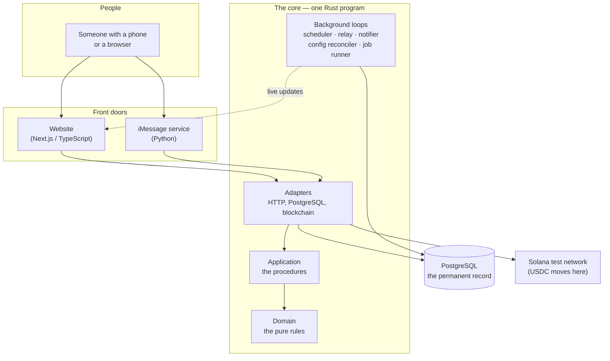
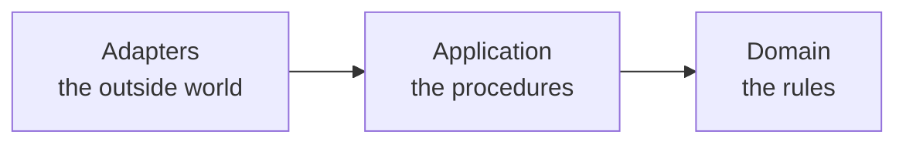
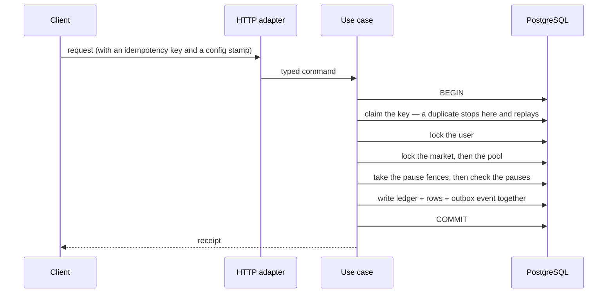

# The big picture

Here is the whole system on one page. Every box is explained below.

## The front doors

**The website** is what most people use: browse markets, vote, trade, watch prices move
live. It is a normal modern web app, and it is installable — it ships a web-app manifest
and a service worker, so you can add it to a phone's home screen and it behaves like an
installed app.

**The iMessage service** is the unusual one. You text the service in plain English —
*"buy $5 of yes on hot-dog-sandwich"* — and it reads your message, shows you a preview,
and waits for you to reply "yes" before doing anything.

!!! warning "The bot can never spend your money by itself"
    A language model reads your message and *proposes* an action. It cannot execute it.
    Execution requires you to reply with a word from a short, literal allow-list —
    `confirm`, `yes`, `y`, `yep`, `do it`, `lock it`, `yes do it` — matched by plain
    string comparison, not by an AI judgement. Anything else cancels the pending action
    and re-routes the message. This is deliberate: an AI that misunderstands should cost
    you a confusing reply, never your balance.

## The core, in three layers

This is the most important structural idea in the codebase.

**Domain — the rules.** Pure arithmetic: what a trade costs, what a share is worth at
settlement, whether a set of ledger entries balances, how a vote scores, which market
state changes are legal. It has no idea that databases or websites exist. You can read and
test it like a maths textbook. It is about 3,700 lines across fifteen files — small
enough to read in an afternoon, and the part you would check first if you wanted to know
whether the money is safe.

**Application — the procedures.** The step-by-step recipes: "to place a trade, first claim
the idempotency key, then lock the user, then read the market, then ask the domain for the
price, then write the ledger entries and the trade row together." It describes *what* must
be saved but not *how*. This is by far the biggest layer, at roughly 61,000 lines,
because careful sequencing is verbose and because the in-memory test doubles live here too.

**Adapters — the outside world.** The concrete implementations: the PostgreSQL code, the
HTTP endpoints, the WebSocket gateway, the blockchain client, the language-model clients.
About 41,000 lines. Replaceable without touching the rules.

Arrows only ever point **inwards**. The domain cannot call the database; the database code
cannot decide business rules. This is enforced automatically — `just deps-check` runs a
script that inspects the actual dependency graph and fails if anyone crosses the line, and
a second check greps for database or web types leaking into the application layer.

!!! tip "Why bother?"
    Three payoffs. The money rules can be tested in milliseconds with no database. The
    same rules can be re-verified against a fake *and* against real PostgreSQL using one
    shared test suite. And a change to storage can never silently change what a trade
    costs.

## The background loops

A lot of what the system does is not a response to a request. When the server starts it
spawns several loops, each doing one job:

| Loop | How often | What it does |
|---|---|---|
| **Scheduler** | every second (configurable) | Advances markets whose time has come: open, freeze the tally, close, sweep, resolve, pay. |
| **Outbox relay** | every 100 ms | Reads newly written events and broadcasts them to connected browsers. |
| **Notifier** | every 100 ms | Reads the same events through its own cursor and turns them into user notifications. |
| **Config reconciler** | every 200 ms, plus wake-ups | Keeps each process's copy of the live configuration in step with the database. |
| **Ops job runner** | every 200 ms | Drains durable admin commands, holding a lease so two servers cannot run one job twice. |
| **Alert delivery** | every minute | Pushes undelivered incident pages out of a durable outbox. |
| **Invariant sweep** | every minute, with `--continuous` | Re-checks the whole ledger against fourteen accounting identities. |

The pattern to notice: every one of them reads from the database and is safe to run more
than once. None of them holds important state in memory. Restart the server and nothing is
lost except the current second's timing.

## What each piece is written in, and why

| Piece | Language | Why |
|---|---|---|
| Core | Rust (pinned to 1.97.1) | Money arithmetic must never overflow silently or produce surprise nulls. The project also forbids unsafe code and floating-point arithmetic outright, at the compiler level. |
| Website | TypeScript / Next.js 15 with React 19 | Best-in-class for a fast, installable, phone-friendly interface. |
| iMessage service | Python 3.12, FastAPI + LangGraph | The language-model ecosystem lives here. |
| Storage | PostgreSQL 16 | Real transactions, real constraints. The database itself refuses unbalanced money and illegal withdrawal states. |

!!! note "One database, despite what the README says"
    The project's top-level README describes the stack as "Axum/Tokio/SQLx/Postgres/Redis/
    NATS", and the local `docker-compose.yml` does start a Redis and a NATS container. No
    crate depends on either. Everything — queues, the event outbox, live-update fan-out,
    leases, configuration — is done in PostgreSQL. Those two containers are aspiration,
    not architecture, and you can ignore them.

## The one-way door for data

Money-changing requests all follow the same shape:

The order is not a suggestion — it is the same in every money path, and it is written into
the first comment of each use-case file so a reviewer can check it at a glance.

Three things about that order are load-bearing:

- **Claim the key first**, before reading anything. PostgreSQL gives you no way to recover
  from a duplicate-key error partway through a transaction, so the claim has to come
  before the work, not after it.
- **Lock in a fixed order** — key, then user, then market, then accounts by id. Two
  operations taking the same locks in different orders can freeze each other permanently.
- **Check the pause switches after the locks**, immediately before the first write. A
  request that was queued waiting for a lock therefore sees the pause when it wakes up,
  instead of having checked before it started waiting. A kill switch that can be raced is
  not a kill switch.

## Where to go next

- [Why the code is split up](clean-architecture.md) — the layering, in more depth.
- [Tour of the codebase](codebase-tour.md) — what is in each folder.
- [How live updates work](live-updates.md) — the outbox and the WebSocket, end to end.
- [The ledger](../money/ledger.md) — how money is actually recorded.
