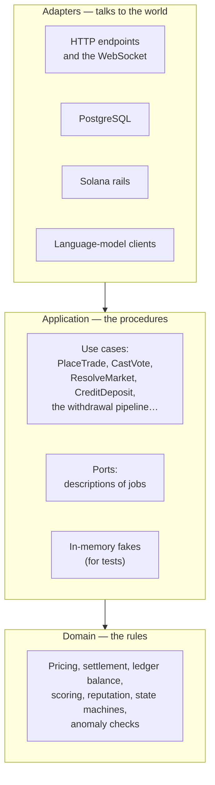
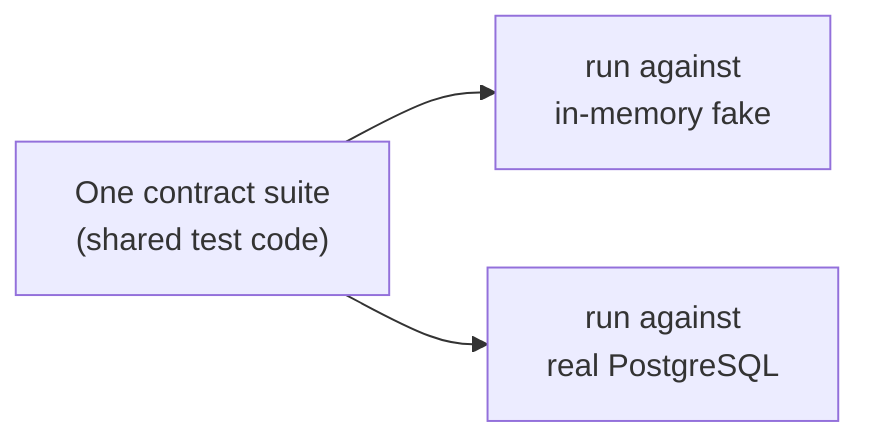

# Why the code is split up

Software people call this layout **clean architecture** or **ports and adapters**. This
page explains it without assuming you know either term.

## The problem it solves

Imagine writing the trading logic directly inside the code that talks to the database.
It works. Then one day you need to answer a question like:

> *"If a user buys $5 of yes in a market with these exact reserves, what should they get?"*

To answer it you now need a running database with the right rows in it. To test a hundred
edge cases you need a hundred database setups. And when you change how data is stored,
you risk accidentally changing what a trade costs — because the two are the same code.

Splitting them up fixes this permanently.

## The three rings

**Domain** is pure. Give it numbers, get numbers. No clock, no network, no database. If
the domain says a $5 buy yields 21.1726 shares, that is a fact you can check on paper.

**Application** orchestrates. It knows the *order of operations* for a trade, but it does
not know what a database is. Where it needs the outside world, it asks through a **port**.

**Adapters** implement the ports. PostgreSQL is one implementation. Note that the
in-memory fakes live in the application layer, not the adapter layer — they depend on
nothing outside it, which is precisely what makes them fast.

## What a "port" actually looks like

A port is a short list of jobs, written as a Rust trait. In plain terms:

> *Something that can: read a market and lock it; read a pool and lock it; apply a set of
> ledger entries; save a trade row; append an outbox event.*

The use case says "I need one of those." At startup, the real program hands it the
PostgreSQL version. In tests, the same use case is handed the fake version. **The use case
cannot tell the difference, and that is the point.**

!!! note "Small ports, not one giant one"
    Rather than one huge `Database` interface, the code has many small ones —
    `MarketQueries`, `CreditIo`, `OutboundIo`, `ConfigReads`, and one transaction trait per
    write path (`TradeTx`, `VoteTx`, `ResolveTx`, `WithdrawTx`, …). A use case asks only
    for the jobs it truly needs, so you can see its full reach from its signature. Software
    people call this the *interface segregation principle*; the practical benefit is that
    "what can this code touch?" is answerable at a glance.

## The trick that makes fakes trustworthy

A fake is only useful if it behaves like the real thing. So the project has **contract
suites** — in `crates/application/src/contract/` — written once and run twice: against the
in-memory fake and against real PostgreSQL.

If the fake ever drifts from real behaviour, the shared suite fails on one side and not
the other. Tests stay fast in daily work while remaining honest about reality.

!!! warning "This nearly failed silently, once"
    During the final verification pass, three of the PostgreSQL-side contract suites were
    found to be *skipping* rather than running. Each needed its own scratch database in
    the connection string, and without one, twenty-six tests "passed" in 0.00 seconds
    without touching a database at all. The fix was to make each suite create and migrate
    its own database. The lesson is on [Tests and quality gates](../running/tests-and-gates.md):
    a green tick that measures nothing is worse than a red one.

## The dependency rule, enforced by a robot

The rule is: **arrows point inwards only.**

| Crate | May depend on |
|---|---|
| `domain` | nothing internal |
| `application` | `domain` |
| `adapters` | `domain`, `application` |
| `main` | all three |
| `simswarm` | nothing internal — it drives the running server over its public API only |

This is not a matter of discipline. `scripts/check_dependency_rule.py` reads the real
dependency graph from the build tool and fails the build on any illegal edge — including
edges introduced only by test or build dependencies, which is where this kind of rot
usually starts.

Two more mechanical guards ride along in `just deps-check`:

- **No storage or web types in the application layer.** A grep for `sqlx` or `axum` in
  `crates/application/src` fails the build. This is blunt and it works.
- **HTTP clients live in exactly three files.** Any construction of an HTTP client outside
  the audited transport modules — the language-model client, the swarm's transport, and
  the blockchain rails — fails the build. If code can make an outbound network call, that
  fact is visible from its file path.

## Design patterns, used sparingly

The codebase uses a few named patterns — but only where they solve a real problem:

- **Repository / ports-and-adapters** — everything above.
- **Transactional outbox** — events written inside the money transaction, then delivered
  by separate readers, so a notification can never disagree with the ledger.
- **Saga** — publishing a market happens in recorded stages, so a crash resumes rather
  than duplicating.
- **State machine** — markets and withdrawals move through explicitly listed states, and
  the database itself rejects any combination not on the list.
- **Newtypes** — a micro-dollar and a micro-share are different Rust types, so you cannot
  accidentally add one to the other. The compiler catches the confusion that in most
  systems becomes a production incident.
- **Leases** — background jobs claim work for a bounded time, so a crashed worker's work
  becomes available again instead of being stuck forever.

You will not find patterns applied for decoration. If a plain function does the job, the
project uses a plain function.

## Where to go next

- [Tour of the codebase](codebase-tour.md) — the actual folders.
- [The control plane](control-plane.md) — how live configuration reaches a running trade.
- [Rules that can never break](../money/invariants.md) — the safety net around all of this.
