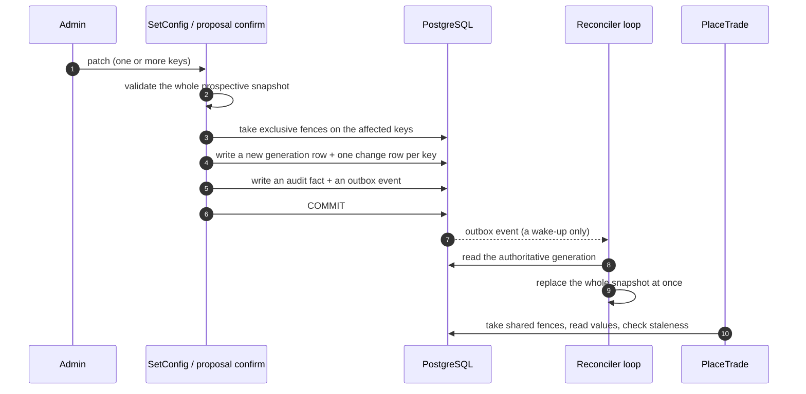

# The control plane

Every tunable number in this system — the fee, the position caps, the anti-fraud
thresholds, the kill switches — lives in a database table rather than in the code. This
page explains how a change reaches a running trade, and the four questions the design
insists on answering about every single setting.

## Four questions per setting

There is one catalog, in `crates/application/src/ops/config.rs`, and every entry in it
carries four attributes. A key that does not exist in the catalog cannot be written at all.

**1. What are its legal values?** Every key has a validation function with real bounds. The
fee must be between 10 and 200 basis points. The vote-velocity threshold must stay inside
±50% of its published value. Integrity thresholds must stay inside ±20% of the *shipped
default* — deliberately anchored to the original rather than to the current value, so
repeated small changes cannot walk a threshold anywhere over time.

**2. Who may change it?** One of four roles: `curator`, `ops`, `finance`, `superadmin`.
Superadmin may act for any listed role; nobody else may act outside their own.

**3. How is it changed?** *Direct* means one authorised person applies it. *Two-phase*
means one principal proposes and a **different token id** confirms. Anything touching
money economics is two-phase.

**4. When does it take effect?** This is the attribute people forget, and it is the one
that prevents the worst abuses:

| Apply class | Meaning | Example |
|---|---|---|
| **Immediate global** | Visible at the next trade's fence point, everywhere | `trading_paused`, feature flags |
| **Next trade** | Read when the next trade computes its fee or cap | `min_fee_bps`, the tier discounts |
| **New market only** | Applies to markets created after the change; an open book never reprices | `trade_fee_bps`, the pool seeds |
| **Live immutable** | Stamped onto a market at creation and never moved afterwards | `hidden_window_secs`, `min_votes_to_resolve_floor` |

The last two are the interesting ones. They are what stops an operator from changing the
rules of a game already in progress. You cannot reprice a market people are already
trading in, and you cannot move the blackout window on a market that is already running.

## The published catalog

These are the values migration `0008` seeds as generation 1, and the operator
documentation publishes them alongside their bounds. This is a representative selection;
the full table is in `docs/copy/ops.md`.

| Key | Seeded value | Bounds | Who | How | When |
|---|---:|---|---|---|---|
| `trade_fee_bps` | 100 | 10–200 bp | Finance | two-phase | new markets |
| `min_fee_bps` | 10 | 0–50 bp | Finance | two-phase | next trade |
| `fee_discount_bp_by_tier` | `[0,0,10,20,30]` | monotone, each ≤ the fee | Finance | two-phase | next trade |
| `position_cap_micro_by_tier` | `[$25,$50,$100,$250,$500]` | monotone, never below the published floors | Finance | two-phase | next trade |
| `rep_tier_thresholds_micro` | `[0,0.2,0.4,0.6,0.8]` | five monotone entries | Finance | two-phase | next trade |
| `discount_flip_window_secs` | 3,600 | 600–86,400 s | Finance | two-phase | next trade |
| `hidden_window_secs` | 300 | 60–900 s, less than the market's life | Finance | two-phase | live-immutable |
| `min_votes_to_resolve_floor` | 3 | at least 3 | Finance | two-phase | live-immutable |
| `oi_floor_micro` | 0 | 0–$1,000 | Finance | two-phase | live-immutable |
| `payout_hold_threshold_micro` | $500 | $1–$10,000 | Finance | two-phase | live-immutable |
| `max_votes_per_window` | 30 | ±50% band | Ops | two-phase | immediate |
| `integrity_young_share_max_ppm` | 500,000 | ±20% of the shipped default | Superadmin | two-phase | immediate |
| `trading_paused` | `false` | boolean | Ops | direct | immediate |
| `market_paused:{uuid}` | unset | boolean | Ops | direct | immediate |
| `voting_paused:{uuid}` | unset | boolean | Superadmin | two-phase | immediate |
| `proposal_ttl_secs` | 900 | 60–3,600 s | Superadmin | two-phase | immediate |
| `dual_control_delay_secs` | 60 | 0–86,400 s | Superadmin | two-phase | immediate |

Notice the change-rate limits, which are separate from the bounds. The fee may move at
most 20 bp per apply; each tier discount at most 10 bp per apply; seeds and budgets at most
double or halve. A key can be legal to set to a value and still illegal to *jump* to it.

!!! warning "The catalog and the running process are two different things"
    The catalog above is the operator-facing configuration store: validated, versioned,
    audited, and consulted at trade time for staleness. But some of the same numbers also
    exist as process-level settings that `main` reads from environment variables at
    startup — and the built-in defaults there are permissive (no tier discount, no position
    cap). A server started with none of those variables set will not apply the published
    tier policy. Treat the table above as the documented, intended policy rather than as a
    description of what a bare `cargo run` enforces.

## How a change propagates

Four things in that diagram do real work:

**Validation is on the whole prospective snapshot, not the patch.** If you change the base
fee and the discount vector together, the check runs against the combined result. A patch
that would leave the configuration internally inconsistent is rejected as a whole; there is
no partial application.

**Fences are locks.** A configuration change takes an exclusive lock on the keys it
touches; a trade takes a shared lock on the ones it reads. They cannot interleave. This is
the mechanism behind "a kill switch that can be raced is not a kill switch": a trade that
was queued waiting for a row lock takes its fence when it wakes, and sees the pause.

**The event is a wake-up, not the data.** The reconciler never trusts the event's payload —
it re-reads the authoritative generation from the database and swaps its snapshot in one
piece. A missed event costs a little latency, because a heal tick reloads periodically
anyway; it never costs correctness.

**Every change is its own audit row.** `config_changes` records the old value, the new
value, the generation, and who did it, for every key. That is also what the emergency
revert reads: rather than typing values back in from memory, an operator can propose a
revert *of a generation*, pre-filled from history.

## Pauses, and the honesty rules around them

There are three pause switches, and the rules around them are unusually explicit because a
pause is the most tempting thing in the system to abuse.

- **Trading pause** — global or per market. Stops new trades. Does **not** stop votes.
- **Voting pause** — per market, and it stops both votes and trades while active. It
  requires superadmin and two-phase approval, because pausing the oracle is the most
  dangerous button here.
- The voting pause **cannot be set inside the hidden-tally window, and expires
  automatically when that window begins.** This closes a specific manipulation: without it,
  an operator could freeze voting just as the tally went dark and hold the final public
  number in place. No admin action is required to lift it; the market's own timestamp does.

The operator documentation states the boundary in plain terms: a pause is not a
configuration hatch. It cannot move a live market's close time, its hidden-tally timestamp,
its fee, its participation threshold, or any other stamped economics. An emergency revert
that would only touch pause keys is rejected outright.

## Dual control, in detail

Anything that moves money by hand requires two different people. The list includes: large
withdrawals, manual credit grants, unwinding a market, remedial credits, receivable
write-offs, banning and unbanning a user, clearing an anti-money-laundering flag, lifting a
self-exclusion, and changing a live market's fee.

Each is a durable **proposal** row carrying:

- an immutable fingerprint of exactly what was proposed, so the confirmation cannot
  approve something subtly different;
- a **minimum delay** before it may be confirmed — 60 seconds for ordinary dual-controlled
  actions, 15 minutes to ban a user, and 24 hours to release the funds of a frozen account;
- an **expiry**, seeded at 15 minutes;
- **two separate audit facts**, one for the proposal and one for the confirmation;
- a database check that the confirmer's token id differs from the proposer's.

That last point matters more than it looks. The two-person rule is enforced by the
*schema*, not only by the code that writes to it.

A confirmer arriving late — after the effect already committed — reads back the existing
result instead of producing a second one. And at most one pending proposal may exist per
subject and kind, so two admins cannot open competing proposals against the same thing.

!!! note "How narrow 'a different person' is"
    The project is deliberately explicit that its notion of who is linked to whom is thin.
    An account counts as linked to an admin principal only when the user's handle exactly
    equals that principal's stored token digest. That is stated as a known bound rather
    than dressed up as an identity graph — the kind of honesty that is easy to skip and
    expensive to discover later.

## Where to go next

- [Keeping it legal and safe](../money/compliance.md) — the rules these controls administer.
- [Placing a trade](../walkthroughs/trade.md) — where the fences are taken.
- [How live updates work](live-updates.md) — how a pause reaches a browser.
