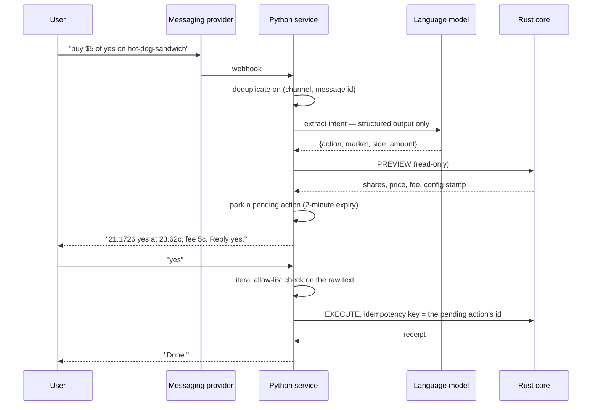

# The website and the iMessage bot

Two front doors, very different in nature. Both talk to the same Rust core through the
same public API — neither has a private shortcut into the database.

## The website

Built with **Next.js 15** (a React framework) in TypeScript. It ships a web-app manifest
and a service worker, which is what makes it installable: add it to a phone's home screen
and it opens like an app, in portrait, without browser chrome.

The pages it has:

| Route | What it is |
|---|---|
| `/` | The market feed, with the featured market front and centre |
| `/m/[slug]` | One market: the question, the video, prices, the chart, the activity tape, top holders, comments |
| `/portfolio` | Your positions and your realised results |
| `/u/[id]` | A public profile |
| `/withdraw` | The withdrawal flow |
| `/how-it-works` | Player-facing explanation of the mechanism and scoring |
| `/admin`, `/admin/config`, `/admin/switches`, `/admin/audit` | The operator surfaces |

Everything reaches the core through one proxy path (`/core-api/...`), configured by a
single environment variable. There is no second way in.

The design deliberately does not look like a trading terminal. The thesis is that a market
about opinions should feel like a place people argue, not a brokerage.

### How live updates stay honest

Prices, trades, tallies and lifecycle changes arrive over a **WebSocket** — a connection
that stays open so the server can push. The full mechanism, including why the browser has
to tolerate the occasional duplicate, is on [How live updates work](live-updates.md).

The short version: a browser subscribes to a market, immediately gets a snapshot of
current truth, and then receives a stream of numbered changes. If it disconnects, it
reconnects and gets a fresh snapshot rather than trying to replay history.

During the hidden-tally window the server simply does not send tally information. The
concealment is enforced at the source, not by the browser choosing not to display it.

## The iMessage service

Built in **Python 3.12**, using FastAPI for the web endpoints and LangGraph to structure
the conversation as a graph of steps. You text the service in ordinary English and it
responds. It talks to Sendblue's sandbox for message delivery.

### The safety rule, precisely

The language model **cannot execute anything**. It reads and proposes. The gate between a
proposal and money moving is not an AI judgement — it is a literal string comparison
against a short allow-list: `confirm`, `yes`, `y`, `yep`, `do it`, `lock it`, `yes do it`.

Anything else *cancels* the pending action and re-routes the message. Not "asks again" —
cancels. The default is to do nothing.

Four more properties make that gate hard to slip past:

- **The confirm check runs before the router**, on raw inbound text. There is no path where
  a model's routing decision precedes the confirmation gate.
- **The pending action expires in two minutes.** A "yes" arriving after that does not
  execute a stale preview.
- **A stale confirmation never executes the old plan.** If the configuration generation has
  moved since the preview, the service expires the pending action, takes a *fresh* preview
  at the new generation, and requires a **new** "yes". You are never filled on a price you
  were shown two minutes and one fee change ago.
- **The idempotency key is the pending action's id.** If the core call times out, the user
  can safely re-confirm: the retry carries the same key, so it replays rather than
  re-executing.

This matters because language models are confidently wrong sometimes. The blast radius of
a misunderstanding here is a confusing message, never a surprise trade.

### Everything is recorded

Each conversation run is written to the project's own PostgreSQL — `agent_runs`,
`agent_steps`, `pending_actions`: what the user said, what each step saw, what the model
decided and the one-line reason it was required to give, the exact rendered prompt and
model version used, and the causal chain from the run to the pending action to the trade to
the ledger transaction.

That record has two jobs. Debugging ("why did it misread that?") and audit ("prove why $44
moved after a chat message"). A trace stored only in a third-party observability tool would
satisfy neither: those expire, and these logs contain phone numbers.

## Why two front ends at all

Different moments. The website is where you browse and decide. The text bot is where you
act on an impulse — someone sends you a link, you reply to a message, and you are done in
two texts without installing anything. It is also the project's stated distribution
advantage: a competitor without it has no way to reach someone mid-conversation.

Because both go through the same API and the same use cases, neither can develop its own
notion of what a trade costs.

## Where to go next

- [Placing a trade](../walkthroughs/trade.md) — the same trade through both doors.
- [How live updates work](live-updates.md)
- [The big picture](big-picture.md)
