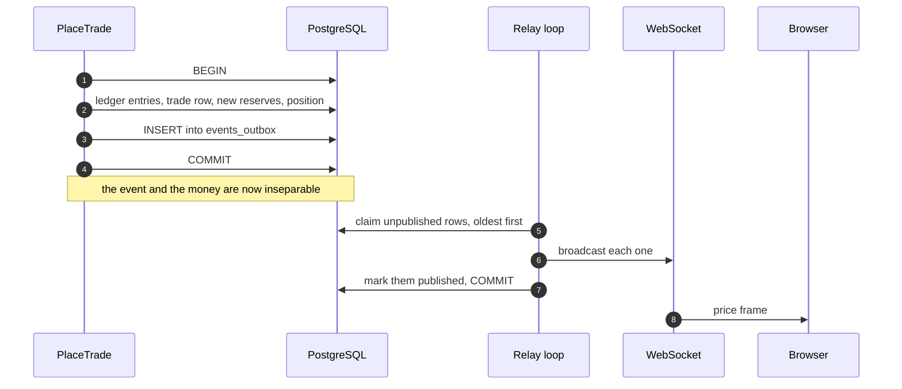

# How live updates work

When somebody trades, every other person watching that market sees the price move within
about a tenth of a second. Nobody's browser is asking "anything new?" on a timer. This page
follows one price change from a database transaction to a pixel, and explains why the path
has the shape it does.

## The problem with the obvious approach

The obvious way to notify people is: save the trade, then send the message.

```
save the trade   ✅
send the message ❌ ← the server dies here
```

Now a trade happened that nobody was told about. Reverse the order and you get the
opposite bug: a message about a trade that never saved. Either way the notification and
the fact disagree, and once they can disagree you can no longer trust either one.

This is not a hypothetical. It is the single most common source of "the UI says something
different from the database" in real systems.

## The fix: write the message *inside* the transaction

The pattern is called a **transactional outbox**. The event is written to a table —
`events_outbox` — as part of the very same database transaction that moves the money. It
either both happens or neither does. Then a separate reader delivers it afterwards.



The relay wakes every 100 milliseconds, claims at most 128 unpublished rows in sequence
order, broadcasts them, and marks them published — all inside one transaction of its own.

Two details make it safe to run more than one server:

- It claims rows with `FOR UPDATE SKIP LOCKED`, so a second relay picks up different rows
  instead of waiting or duplicating.
- It broadcasts **before** committing the "published" mark. If it dies in between, those
  rows are still unpublished and will be sent again.

## At-least-once, and why that is the right choice

That last point means delivery is **at-least-once**, not exactly-once. A browser can
occasionally receive the same event twice.

That is a deliberate trade. The alternative — mark published first, then broadcast — would
make delivery *at-most-once*, and a crash would silently lose an update forever. Losing an
event is a bug you cannot detect; receiving one twice is a bug the receiver can fix
trivially.

So the receiver fixes it. Every outbox-derived frame carries an `outbox_seq` — its
position in the global event sequence — and the documented client rule is to discard any
frame whose `(outbox_seq, frame type)` pair it has already handled. The duplicate is
recognised and dropped.

## What actually goes over the wire

The connection is a **WebSocket**: a connection that stays open in both directions, so the
server can push without being asked.

A browser opens one, then sends subscribe messages naming the markets it cares about. The
server replies immediately with a **snapshot** — the full current state of that market —
and then streams changes.

| Frame | Carries | Has a sequence? |
|---|---|---|
| `snapshot` | State, both prices, the tally (if visible), closing and hidden-tally times, whether it is under review, poster and video URLs | No — it is a point-in-time query, not an event |
| `price` | Both prices after a trade | Yes |
| `trade` | Handle, side, buy or sell, size, timestamp, sequence number — the public activity tape | Yes |
| `tally` | Yes and no vote counts | Yes |
| `lifecycle` | A market's new state and, at the end, the final percentage and both redemption values | Yes |
| `trading_paused` / `trading_resumed` | An operator kill switch, globally or per market | Yes |
| `market_voting_paused` / `market_voting_resumed` | A voting pause on one market | Yes |
| `asset` | A newly rendered poster or video, hot-swapped into a live market | Yes |
| `notif` / `notif_snapshot` | Personal notifications and unread count, on an authenticated user channel | Its own id and source sequence |

Every frame also carries a `v` — a protocol version — so the shape can evolve without
breaking older clients.

## Reconnecting without missing anything

A slow or stalled browser is **disconnected**, not queued for indefinitely. Queueing
forever is how one bad client consumes a server's memory.

The recovery is the snapshot-then-stream sequence again: reconnect, re-subscribe, receive
a fresh snapshot of current truth, and resume the stream from there. The browser never
tries to replay what it missed, because it does not need to — the snapshot already contains
the result of everything that happened while it was away.

This is why the snapshot deliberately has no sequence number. It is not an event in the
stream; it is a photograph of where the stream has got to.

## The hidden tally is enforced at the source

During the hidden-tally window the server does not send tally information. Not "sends it
and asks the browser not to display it" — does not send it.

Concretely, the snapshot's tally field is populated only when the market is `Live` *and*
the current time is before its hidden-tally timestamp. Outside that window the field is
simply absent, and no `tally` frame is emitted. A user with the developer console open
learns nothing they should not know.

That is the general principle, and it is worth stating on its own: **if information is
supposed to be secret, the server must not send it.** Client-side concealment is decoration.

## The second reader: notifications

The same `events_outbox` table is read by a second, independent consumer — the
**notifier** — which turns events into personal notifications: someone replied to your
comment, your market resolved, you were mentioned.

It keeps its own position in the stream, in `outbox_cursors`, so the two readers never
interfere. It also holds a lock while it advances, so two servers cannot both materialise
the same notification.

The design rule the notifier follows is worth noting: **database rows are authoritative,
live frames are a best-effort accelerant.** Your notification exists in the database
whether or not the WebSocket frame reached you. If you were offline, you see it when you
come back. The live frame is a nicety, not the record.

## Fault injection

There is a switch that makes the relay artificially slow and another that drops every Nth
WebSocket frame, used to prove that recovery works rather than assuming it does.

Both live behind a **two-factor arm**: any `CHAOS_*` environment variable requires *both*
`OPINIONS_ENV=staging` and `CHAOS_ENABLED=1`. Setting one without the other is a startup
error, not a silent no-op — so a chaos knob accidentally left in a production configuration
stops the server rather than quietly degrading it. Each connection also gets its own drop
counter, so concurrent connections cannot change which frame number is dropped and the test
stays deterministic.

## Where to go next

- [The website and the iMessage bot](frontends.md) — what consumes these frames.
- [Placing a trade](../walkthroughs/trade.md) — the transaction that writes the event.
- [The control plane](control-plane.md) — the pause frames, and where they come from.
