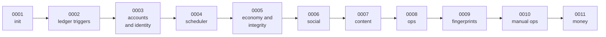

# The eleven migrations

A **migration** is a numbered file of database changes. Run all eleven in order against an
empty database and you get today's schema. They are never edited once shipped, so reading
them in order is also reading the project's history: each one is a phase of construction
made permanent.

The server applies any pending ones automatically when it starts.

---

## 0001 — `init` (339 lines)

The whole skeleton, in dependency order: people, markets, the ledger, the conversation
record, and activity.

- **People**: `users` (with a handle, a KYC tier, a creation time), `wallets`,
  `reputation`.
- **Markets**: `markets`, `outcomes` (the yes and no sides as first-class rows, not
  columns), `pools`, `pool_reserves`.
- **The ledger**: `ledger_accounts` with six owner classes at this point — user, pool,
  fees, house, escrow, external — and two currencies from day one: `usdc` and
  `usdc_credit`. Plus `ledger_transactions` (with a unique idempotency key) and
  `ledger_entries` (amounts may never be zero).
- **Activity**: `trades`, `votes`, `vote_scores`, `positions`, `comments`,
  `comment_votes`, `notifications`.
- **Money in and out**: `deposits`, `withdrawals` — at this stage simple tables that
  Phase 7 would later rebuild.
- **The conversation record**: `agent_runs`, `agent_steps`, `pending_actions` — every
  language-model step, its rendered prompt, and the causal chain from a text message to a
  ledger transaction.
- **Delivery**: `events_outbox`, and `video_jobs`.

Notably, this file contains a *comment* rather than a constraint where sum-to-zero should
be. The author left an explicit note that a cross-row rule cannot be a row-level check,
and that a deferred constraint trigger was a **blocking precondition** for merging any
code that writes to the ledger. That promise is kept by the next file.

## 0002 — `ledger_triggers` (49 lines)

Three triggers, and this is the shortest, most important file in the project.

1. **Balance enforcement.** After any insert, update or delete on ledger entries, a
   deferred constraint trigger groups that transaction's entries by the *currency of each
   account* and raises an exception if any group does not sum to zero. Grouping by currency
   rather than taking one total is deliberate: a single grand total would allow $1 of cash
   to cancel $1 of promotional credit, silently converting one into the other.
2. **No empty transactions.** A transaction header committed with no entries raises.
3. **Append-only.** Any update or delete on a ledger entry raises `ledger_entries are
   append-only`. Not a convention — a wall.

Both of the first two are *deferred*, meaning they run at commit rather than per statement.
That is what lets a use case write its entries one at a time and still be checked as a set.

## 0003 — `accounts_identity` (33 lines)

Tightens the ledger's shape and adds the messaging identity.

- One account per (owner, currency) for owned classes; one singleton per currency for the
  fees and house accounts.
- An account's identity is **immutable**: a trigger forbids changing an account's owner
  type, owner id, or currency, because reclassifying an account would silently
  re-denominate its entire history.
- `user_channels` — the phone-to-user mapping the iMessage service resolves, unique on
  (channel, address).

## 0004 — `scheduler` (19 lines)

Everything needed to advance markets on a timer without doing it twice.

- `lifecycle_commands`, keyed by a string, so "close market X" is recorded once and a
  retry recognises it.
- `markets.curator_flagged_at`.
- Four partial indexes — one per "what is due now?" question the scheduler asks (open,
  freeze, close, resolve). A partial index only covers rows in the relevant state, which
  is what keeps a once-per-second query cheap as the table grows.

## 0005 — `economy_integrity` (41 lines)

The reputation economy and the anti-manipulation machinery.

- `votes.cast_ip` and `votes.device_hash` — the metadata the post-close integrity sweep
  analyses. Note it is *recorded* here, not checked at vote time.
- `markets.lp_pnl_micro`, `settled_at`, `integrity_due_at` — the house's profit or loss on
  seeding each pool, and when its integrity review is due.
- `realizations` — every profit-or-loss event, tagged `sell`, `settlement` or `void`, with
  a uniqueness rule per (transaction, user, outcome). This is what leaderboards are built
  from, so they report real money rather than a recomputed guess.
- `integrity_reports` — one per market, holding the four checks' numbers and the verdict.
- A backfill giving every existing user a zero reputation row.

## 0006 — `social` (83 lines)

Threaded discussion, with the backfill done carefully.

- `comments` gains `depth`, `reply_count` and a normalised `body_hash`, and gains a
  constraint that a reply must belong to the same market as its parent.
- The depth backfill is a recursive query that tracks the path it has walked and refuses
  to follow a cycle — then a verification block *raises an exception* if any reply ended up
  at depth zero or beyond 32. A migration that checks its own work.
- Existing comments deliberately keep a NULL body hash, because PostgreSQL cannot reproduce
  the application's text-normalisation pipeline exactly. A NULL never matches the duplicate
  lookback, so old rows simply do not participate rather than participating wrongly.
- `comment_reports` and `outbox_cursors` — the latter is what lets a second, independent
  reader consume the same event stream at its own pace.

## 0007 — `content` (89 lines)

The market supply chain.

- `market_drafts` — a proposed market with its question, its tier, its seed, its fee, its
  participation minimum, and its open and hidden-window durations. A check constraint
  enforces that the hidden window is shorter than the market's own life.
- A publication **saga**: a `publish_stage` column walking `claimed → seeded → live →
  jobs_enqueued → published`, so a crash resumes instead of publishing twice. The published
  market id is committed at the `claimed` stage *before* the market row exists, which is
  why it deliberately carries no foreign key — a comment in the file explains the choice
  rather than leaving it to be discovered.
- `video_jobs` gains leasing: a claim token, a lease expiry, an attempt count, and an
  availability time for backoff.
- `moderation_jobs`, the same shape for moderation work.

## 0008 — `ops` (234 lines)

The admin control plane — the largest migration before Phase 7.

- **Configuration**: `config_entries`, a monotonically increasing `config_generation`, and
  `config_changes` recording every old and new value with who changed it. The generation
  number is what a trade preview stamps itself with.
- **Two-phase approval**: `config_change_proposals`, where sensitive keys must be proposed
  by one principal and confirmed by a different one.
- **Audit**: `admin_actions`, written in the same transaction as the action itself.
- **Unwinding a market**: `market_unwinds` and `ledger_entry_reversals`.
- **Receivables**: `receivables`, `receivable_movements`, and
  `receivable_write_off_proposals`. When unwinding a market would push someone's balance
  negative, the shortfall becomes a tracked non-cash debt rather than a silently absorbed
  loss.
- **The seed**: 36 configuration values inserted as generation 1, including the 1% fee,
  the tier discounts, the position caps, the integrity thresholds and the feature flags —
  and a companion insert recording all of them as change rows attributed to
  `migration:0008`. The configuration table has an audit trail from its first instant.

## 0009 — `request_fingerprints` (11 lines)

Eleven lines that close a real hole.

An idempotency key alone answers "have I seen this key?" — not "was it the *same*
request?". This table stores a canonical fingerprint of each request alongside its key.
On a repeat, the fingerprint is compared **first**: a match replays the original receipt
with no further checks, and a mismatch is a typed conflict error. Without it, reusing a key
with different parameters would return the wrong receipt.

## 0010 — `w2_manual_ops` (37 lines)

- `remedial_credit_proposals` — a capped, audited house grant to a user, requiring two
  distinct principals and a minimum delay. A database check enforces that the confirmer's
  token id differs from the proposer's, so the two-person rule does not depend on the
  application remembering it.
- `ops_job_commands` — durable, leased manual operations (replaying a job, re-fanning-out
  notifications), so an admin action survives a restart and cannot run twice.

## 0011 — `money` (426 lines)

The Phase 7 money and compliance schema. Its header names its authority explicitly: the
withdrawal constraints derive from the state table published in `docs/copy/ops.md`.

**Ledger account classes go from six to nine.** The file drops and rebuilds the owner-type
constraint to admit `withheld`, `deposit_suspense` and `bonus_reserve`, and extends the
singleton index so there is exactly one of each per currency.

**Users gain a status** — `active`, `shadow_limited` or `banned`.

**Withdrawals are rebuilt.** Three state dimensions (`status`, `review_state`,
`send_state`), three transaction links (`hold_tx_id`, which is mandatory; `release_tx_id`;
`settle_tx_id`), a request fingerprint, risk reasons, and four timestamps. Then the check
constraint that only permits the fifteen legal combinations, forbids both a release and a
settle, and ties `settled` to having a settle link and `denied`/`failed` to having a
release link. Old rows that cannot be honestly reconstructed are moved to a quarantine
table rather than being given invented history.

**Deposits become a machine.** Source and destination address, mint, observed slot, a rail
fingerprint, and three transaction links for suspense, admission and refund — with checks
that a deposit cannot be both admitted and refunded and that an observation carries its
full on-chain identity.

**New tables:**

| Table | Purpose |
|---|---|
| `withdrawal_events` | Every state change, append-only |
| `outbound_payments`, `outbound_send_attempts` | The signed-before-broadcast payment lineage, with unique indexes allowing at most one live attempt and at most one finalised attempt ever |
| `money_command_proposals` | Generic dual control, with at most one pending proposal per subject and kind |
| `kyc_events`, `sanction_screenings`, `aml_flags`, `compliance_decisions` | Who may do what, and why |
| `credit_grant_lots`, `credit_fee_allocations` | Promotional credits and their fee-earning progress, with uniqueness rules that make double-counting impossible |
| `referral_codes`, `referral_binds` | One code per person, one binding per referee |
| `phone_verifications` | Possession proofs and the unique-verified-number rule |
| `self_exclusions`, `user_deposit_limits` | Responsible-gaming controls |
| `alert_outbox` | Durable incident delivery bookkeeping |

## Where to go next

- [Where the data lives](the-database.md) — which rules live in which layer.
- [The fifteen withdrawal states](../money/withdrawal-states.md) — the table `0011` implements.
- [The control plane](control-plane.md) — what `0008` seeded, and how it changes.
