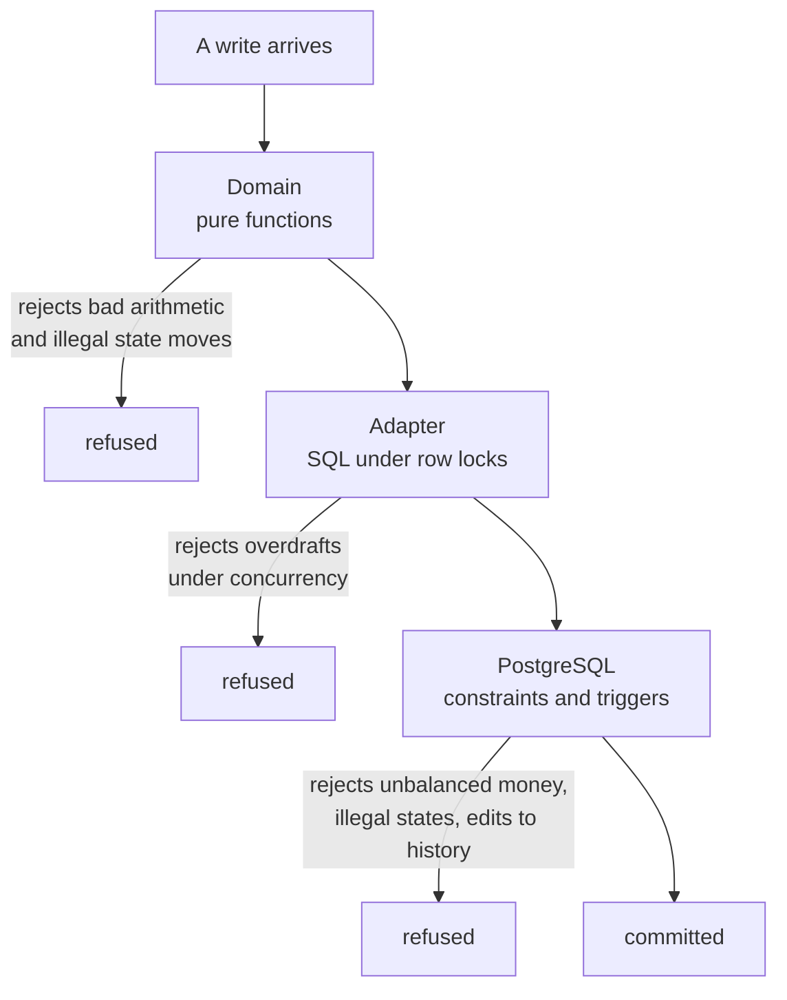

# Where the data lives

Everything permanent lives in **PostgreSQL**, a relational database. This page explains
what is stored and — more interestingly — where correctness is actually enforced, which is
in more than one place and not always where you would guess.

## Three places a rule can live

When somebody says "the system won't let money go missing", it is worth asking *which*
system. In this project a rule can be enforced in three different layers, and they are not
interchangeable:

| Layer | What it catches | What it cannot catch |
|---|---|---|
| **The domain** — pure Rust functions | Bad arithmetic, illegal state moves | Anything that never calls it |
| **The adapter** — the SQL-writing code, under row locks | Concurrent writers racing each other | Someone bypassing the application |
| **The database** — constraints and triggers | Everything, including a hand-typed `INSERT` | Nothing; it is the floor |

Most projects put every rule in the first layer. This one deliberately spreads them, and
being precise about which rule lives where is the point of this page.

## What PostgreSQL itself refuses

These are real constraints and triggers in the migration files. They hold no matter what
the application does — a buggy code path, a bad migration, or a person with a database
console cannot get around them.

**A set of ledger entries that does not sum to zero cannot be committed.** A deferred
constraint trigger re-checks the sum at commit time, grouped by currency. Grouping matters:
a transaction-wide total would let you cancel out $1 of real cash against $1 of
non-withdrawable promotional credit, which is exactly the kind of conversion the currency
split exists to forbid.

**A transaction header with no entries cannot be committed.** A second deferred trigger.

**Ledger entries cannot be updated or deleted, ever.** A trigger raises an exception on
any attempt. Corrections must be new, opposite entries.

**An entry cannot have an amount of zero.** A column check.

**Two transactions cannot share an idempotency key.** A uniqueness constraint. This is the
mechanism behind "nothing happens twice".

**There is exactly one external account per currency**, and exactly one each of the fees,
house, withheld, deposit-suspense and bonus-reserve accounts per currency. Unique indexes.

**A withdrawal cannot exist in a state combination that is not on the approved list.** The
fifteen legal combinations are written into the table as a check constraint, along with
the rules that an accepted row always has a hold, and that it can never have both a
release and a settle recorded. See [The fifteen withdrawal states](../money/withdrawal-states.md).

**A deposit cannot be both admitted and refunded**, and an observed deposit must carry its
full on-chain identity. Check constraints.

**A payment can have at most one live send attempt and at most one finalised attempt,
ever.** Partial unique indexes — the mechanism that makes double-paying structurally
impossible rather than merely unlikely.

**One referral code per person**, and one binding per referee. Unique indexes.

**At most one pending dual-control proposal per subject and kind.** A partial unique index,
so two admins cannot open competing proposals against the same thing.

## What PostgreSQL does *not* enforce

One correction worth making loudly, because it is easy to assume otherwise:

!!! warning "Non-negative balances are enforced in the application, not the database"
    There is no stored balance column and no database constraint saying an account may not
    go below zero. A balance is derived by summing that account's entries.

    The rule is enforced in two places instead. The domain's `Balances::apply` refuses a
    transaction that would take any non-external account below zero. And the PostgreSQL
    adapter, before writing anything, takes a `FOR UPDATE` row lock on every account the
    transaction touches, re-derives each balance by summing its entries, and validates the
    same rule under that lock.

    The lock is what makes it correct under concurrency: two withdrawals racing for the
    same balance cannot both read "enough money" and both proceed. But it is application
    code doing the work. Someone with a database console *could* insert a balanced
    transaction that overdraws an account, and the continuous invariant sweep is what
    would notice.

That is a fair design — deriving balances from entries is what keeps the ledger honestly
append-only — but "the database won't let a balance go negative" would be a false
statement, and it is the kind of thing a code reviewer notices.

## The main tables

| Area | Tables | Holds |
|---|---|---|
| People | `users`, `user_channels`, `phone_verifications`, `reputation`, `wallets` | accounts, linked messaging channels, verified numbers, reputation |
| Markets | `markets`, `outcomes`, `pools`, `pool_reserves` | questions, the yes/no sides, pool state |
| Activity | `trades`, `votes`, `vote_scores`, `positions`, `realizations` | what people did, what they hold, what they made |
| Money | `ledger_accounts`, `ledger_transactions`, `ledger_entries` | the permanent record |
| Money in/out | `deposits`, `withdrawals`, `withdrawal_events`, `outbound_payments`, `outbound_send_attempts` | crossing the boundary |
| Promotions | `credit_grant_lots`, `credit_fee_allocations`, `referral_codes`, `referral_binds` | bonuses and their earning progress |
| Compliance | `kyc_events`, `sanction_screenings`, `aml_flags`, `self_exclusions`, `user_deposit_limits`, `compliance_decisions` | who may do what |
| Operations | `config_entries`, `config_generations`, `config_changes`, `config_change_proposals`, `money_command_proposals`, `admin_actions`, `alert_outbox` | tuning, two-person approvals, audit, alerts |
| Unwinding | `market_unwinds`, `ledger_entry_reversals`, `receivables`, `receivable_movements` | undoing a market, and tracking what it left owed |
| Content | `market_drafts`, `moderation_jobs`, `video_jobs` | the market-creation pipeline |
| Social | `comments`, `comment_votes`, `comment_reports` | discussion |
| Delivery | `events_outbox`, `outbox_cursors`, `notifications` | events written with the money, delivered after |
| Agents | `agent_runs`, `agent_steps`, `pending_actions` | the iMessage conversation record |
| Scheduling | `lifecycle_commands`, `publication_commands`, `ops_job_commands`, `request_fingerprints` | replayable machine work |

## Money is integers

Every amount is a whole number of micro-dollars in a 64-bit column. No decimal types, no
floating point. See [Prices and fees](../money/fees-and-pricing.md) for why this is
non-negotiable.

## Append-only where it counts

Ledger entries, audit records, allocation facts, withdrawal events, and deposit
observations are **never updated or deleted**. Corrections are new rows that reference what
they correct. This means the history is a complete story rather than a current snapshot,
which is exactly what you need when someone asks why a balance is what it is.

## Locks, transactions, and the fixed order

A **transaction** groups changes so they all happen or none do. A **lock** stops two
operations touching the same row simultaneously.

The project fixes the order in which locks are taken — idempotency key, then user, then
market, then pool, then accounts by id — because operations taking locks in different
orders can freeze each other permanently. Where a use case needs many user locks at once,
as settlement and unwinding do, it collects the users, sorts them, and takes the locks in
that sorted order rather than opportunistically.

One deadlock did make it into the code during construction: converting promotional credits
took locks in a different order from unwinding a market. A concurrency test caught it by
*hanging* rather than by failing cleanly — which is the honest symptom, and the reason
those tests exist. The fix used a lighter lock mode for one of the reads so the two paths
could no longer form a cycle.

## Migrations: the database has a history

The schema is built by eleven numbered SQL files run in order. Run them against an empty
database and you get today's schema. The server runs any pending ones itself at startup.

The rule is that a shipped migration is **never edited**. Changes come as new files.

!!! warning "A real bug this caused, and the lesson"
    During construction a migration was edited after it had already been applied to the
    local database. New environments got the corrected version; the existing one kept the
    old shape, and tests failed with a foreign-key error that existed in no source file.
    The fix was to rebuild the database from the files.

    A second version of the same mistake appeared later: a column existed only in one
    worker's private database and had never made it into the migration file at all, so
    that worker's tests passed and nobody else's would have. Both are the same lesson —
    *the files are the truth, and a running database is only a cache of them* — which is
    why the project always rebuilds by globbing the whole directory rather than replaying
    a remembered list.

## Where to go next

- [The eleven migrations](migrations.md) — what each one added.
- [The ledger](../money/ledger.md)
- [Rules that can never break](../money/invariants.md) — the sweep that watches all of it.
