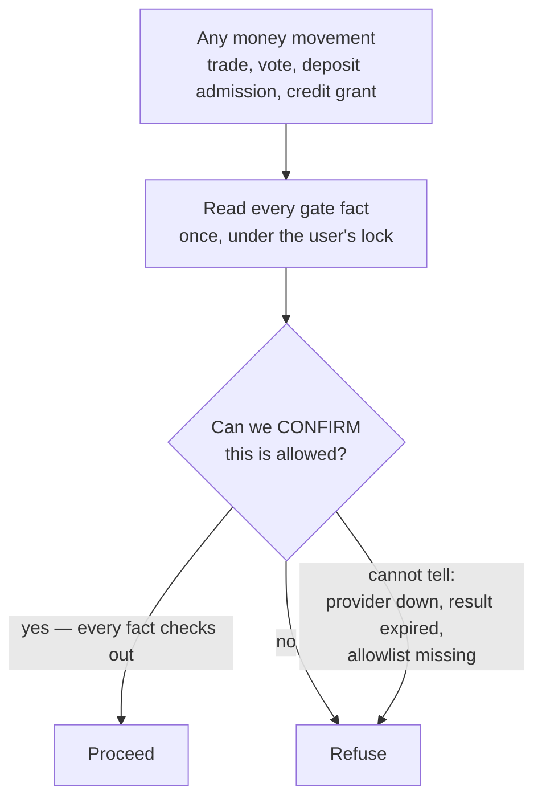

# Keeping it legal and safe

Handling other people's money brings legal obligations. This page explains what the
software does about them — and, just as importantly, what it deliberately does **not**
claim to do.

!!! warning "Not legal advice, and not a compliance certificate"
    This describes engineering. Whether the product may legally operate anywhere is a
    question for lawyers, and that work is explicitly outside the software — the project's
    decision log lists counsel engagement as an open item that gates launch, not
    development. The code is built so that when the legal answers arrive, they can be
    switched on by configuration rather than by a rewrite.

## Fail closed, always

The single most important rule:

> **When the software cannot confirm that something is allowed, it refuses.**

If the identity provider is unreachable, the answer is no. If the region allowlist has not
been configured, *every* region is blocked — not every region allowed. If a screening result
has expired, it does not count.

This sounds obvious and is frequently got wrong. It is easy to write code where a missing
configuration means "no restrictions"; here, a missing configuration means "nothing is
permitted."

The gate is written as two separate pieces on purpose: one function that only *reads* facts
(a straight line of point lookups, no policy at all) and one **pure** function that decides
from those facts. That split means every possible refusal is provable by a unit test with no
database in sight — and it means nobody can accidentally hide a policy branch inside a
database query.

The third arrow is the whole design. "Cannot tell" and "no" go to the same place.

## The gate, fact by fact

Before any money movement, the software reads exactly these facts about the user, all under
one lock:

| Fact | Where it comes from |
|---|---|
| Account status | `active`, `shadow_limited`, or `banned` |
| Self-excluded? | An active self-exclusion row |
| Identity tier, and the tier required | The user's KYC level against configuration |
| Region clear? | A fresh region screening |
| Sanctions clear? | A fresh sanctions screening |
| Deposit limit | A user-set limit, if any |
| Are deposits paused? | An operator switch |
| Shadow caps | The quiet caps applied to a shadow-limited account |

And then applies a policy that differs by what is being attempted:

| Mutation | What it requires |
|---|---|
| **Place a trade** | Not banned, not self-excluded, identity tier met, region clear, sanctions clear, under the shadow cap if shadow-limited |
| **Cast a vote** | Not banned, not self-excluded, **region clear** — and nothing else |
| **Admit a deposit** | Not self-excluded, deposits not paused, identity tier met, region clear, sanctions clear, within the deposit limit. **A ban does not block this** — see below |
| **Grant a credit** | The account must be plain `active`; shadow-limited is not enough |

Two rows there deserve a second look.

Voting requires only that the region is clear. Not the identity tier, not sanctions — a vote
is not a money movement, and the vote gate's job is jurisdiction, not financial screening.

Admitting a deposit is the one operation a *ban* does not block, for the reason on
[Deposits and withdrawals](deposits-and-withdrawals.md): the money physically arrived, and
refusing to book it would make the accounts wrong rather than making it un-arrive. Only the
outbound side of a banned account is frozen.

## Identity

Users have an identity tier: **0 (none)**, **1 (basic)**, or **2 (full)**. The tier required
for depositing and for withdrawing is configurable; the seeded requirement for withdrawal is
tier 2, and if the requirement is unreadable the code falls back to requiring at least
tier 1 rather than to requiring nothing.

An identity result whose validity horizon has passed is **indeterminate**, not "still fine".
And a revocation — a drop back to tier 0 from a positive tier — is treated as a **hit**, not
merely as an absence.

Phone verification is separate and stricter, because it is the anti-sybil defence: **one
verified phone number can only ever be bound to one account**, enforced by a uniqueness rule
in the database. The number is not stored in readable form — a keyed one-way fingerprint is
stored instead, with a key version so the key can be rotated later.

!!! note "A real bug found here during construction"
    When a verification code expired, the number stayed locked to the half-finished attempt
    and could never be used again — a user who mistyped a code once was permanently locked
    out of their own phone number. The fix re-arms that same account's own pending challenge
    rather than creating a second row, while a *different* account attempting the same number
    still gets a hard conflict. The distinction is the whole fix: retrying yourself is not
    the same event as somebody else claiming your number.

## Screening

Every screening answer is one of three values, never a bare true/false:

- **Clear**, stamped with when it was checked, when it expires, and which policy version
  produced it
- **Hit** — a match; the account is frozen for review
- **Indeterminate** — the provider could not answer

Only a *fresh* Clear allows money to move. Indeterminate is treated exactly like a refusal.
And because a Clear expires, a long-running withdrawal is re-screened at the moment of
sending rather than trusting an answer from hours earlier.

The three-value algebra matters more than it sounds. A two-value system forces you to choose
what "the provider is down" means, and under deadline pressure it always ends up meaning
"fine".

## Where the user is

Location is decided by an **allowlist**, never a blocklist: the country must be `US` and the
state must be on an approved list. An unknown state, a missing list, an untrusted network
path — all refuse. The allowlist itself is versioned, so a decision made under one version
can be told apart from one made under another.

The IP address is only trusted when it arrives through a known proxy chain — the direct peer
must be inside a configured range before a forwarded-for header is honoured at all. For the
iMessage channel there is no meaningful client IP, so the user's own verified region is used
instead of the server's location, because a server's location says nothing about a user.

## Anti-money-laundering

Two patterns are watched, at request time and again in a sweep:

- **Velocity** — unusually large volume in a rolling window, tracked per user for both
  deposits and withdrawals, and per destination address.
- **Structuring** — many payments deliberately sized just under a reporting threshold.

Structuring detection needed a subtle fix. The first version counted every payment below the
threshold, which meant four ordinary small deposits looked identical to deliberate evasion.
The rule now counts only payments inside a **band** — at or above a floor and below the
threshold — so ordinary small activity is ignored while just-under-the-limit behaviour is
caught. The pinned in-band test value is $499, which tells you where the band's top sits.

An open flag blocks automatic approval **and** blocks sending. Clearing one requires two
different staff members.

## Two-person control

Anything that moves money by hand requires two different people, and the second cannot be
the first. That covers large withdrawals, manual credit grants, unwinding a market, remedial
credits, receivable write-offs, banning and unbanning, clearing an AML or sanctions flag,
lifting a self-exclusion, and changing a live market's fee.

Each is a durable **proposal** with an immutable content fingerprint, a required waiting
period, an expiry window, and two separate audit records. A second confirmer arriving after
the effect already committed reads back the first confirmation instead of creating a second
effect.

The delays are graded by seriousness: 60 seconds for an ordinary dual-controlled action, 15
minutes to ban a user, 24 hours to release the funds of a frozen account. Full detail on
[The control plane](../build/control-plane.md).

## Frozen accounts, and not stranding money

A banned or sanctioned account cannot transact. But an early version of that rule also
blocked withdrawals, which meant a ban permanently trapped the user's money — an outcome no
operator wants and no regulator likes.

The rule now splits by situation:

| Situation | What can leave |
|---|---|
| Banned, or a sanctions hit | Nothing automatic. Funds stay put; release requires a two-person, counsel-shaped decision with a 24-hour delay, to a destination the user does not choose. |
| Deposit refused, user otherwise clear | Refund to the exact address it came from. |
| Self-excluded user | Withdrawal only to an address they have already successfully used. |

That is the "egress split": freezing somebody is not the same as confiscating from them, and
the code distinguishes the two.

## Responsible gaming

- **Self-exclusion** is user-initiated, effective immediately, and cannot be undone by the
  user during the cooling-off period. Lifting it afterwards takes two staff, and only after
  the cooling-off has actually elapsed — the check is on the timestamp, not on someone's
  judgement that enough time has passed.
- **Deposit limits** are user-set. Lowering one takes effect immediately; **raising one waits
  24 hours**, so a bad moment cannot be acted on instantly.
- **Shadow-limiting** — quietly capping a suspected abuser — is designed to be
  *undetectable*: the error a shadow-limited user sees is constructed to be identical to the
  ordinary published cap message, same error code and same shape, with no vocabulary that
  hints at the real reason. A limit the target can confirm is just a worse ban.

## What is deliberately not built

- **Real identity, sanctions and phone vendors.** Only sandbox implementations exist, and
  they sit behind a two-factor staging switch that makes them refuse outside staging.
- **Mainnet money.** Everything targets test networks. The blockchain identity — which
  network, which token, which wallet — must be fully specified and *remotely validated at
  startup* or the process stays off-rail entirely; there is no partial configuration that
  half-works.
- **The legal opinions themselves**, and the written vendor approvals.

That honesty is intentional: the software should never look more approved than it is.

## Where to go next

- [Deposits and withdrawals](deposits-and-withdrawals.md)
- [The control plane](../build/control-plane.md)
- [Rules that can never break](invariants.md)
