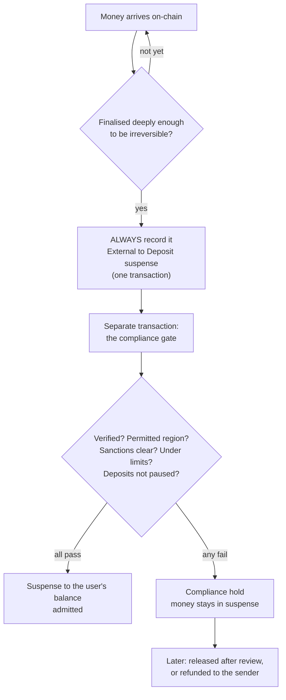
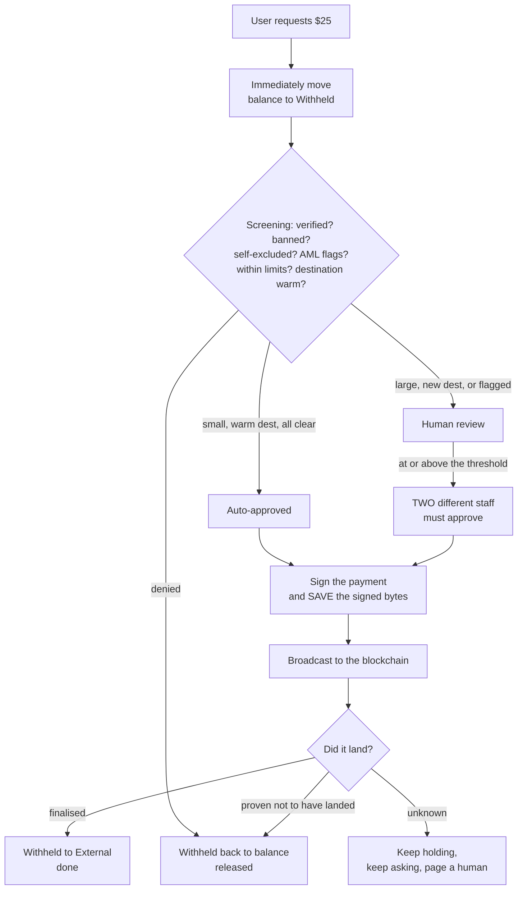

# Deposits and withdrawals

Money crossing the boundary between the real world and the system is the riskiest thing
the software does. This page explains the two flows and the reasoning behind each rule.
[The fifteen withdrawal states](withdrawal-states.md) has the mechanical detail; this page
has the *why*.

!!! note "What exists, and what does not"
    The blockchain rail is real code targeting a Solana test network. The card-based
    "onramp" that would let somebody deposit with a debit card is an open item gated on
    vendor approvals, and is not built. Everything below concerns money that has already
    arrived on-chain, or is leaving that way.

## Deposits: record first, decide second

The instinct is to check the rules and then record the money. This project does the
opposite, on purpose.

### Why record it even when we will refuse it?

Because **the money is already there**. Anyone can send funds to their deposit address at
any moment; nobody asks permission first.

If the software refused to write that down, the wallet would hold money the ledger did not
know about — and the invariant that says the ledger and the wallet agree would break. That
invariant exists to detect theft. An alarm that rings constantly for innocent reasons is an
alarm everybody learns to ignore, at which point it no longer detects theft either.

So: record always, then decide availability separately.

### Why two transactions rather than one?

Because a crash between "the money arrived" and "the money is spendable" has to land
somewhere well-defined.

Splitting the flow means the first transaction is small and always succeeds, and the
deposit sits in a named state — `observed_finalized` — that a later pass can pick up and
finish. A single combined step would have a window where a crash loses the inflow entirely,
and losing an inflow is unrecoverable: the money is on-chain and the books do not know.

The full set of deposit states runs `observed_finalized` → `admission_pending` →
`admitted`, or branches to `compliance_hold` → `refund_approved` → `refund_sending` →
`refunded`. A database check constraint enforces that a deposit can never be both admitted
and refunded, and another enforces that an observation carries its complete on-chain
identity — source address, destination, token, slot — so a deposit row can always be tied
back to a real event.

### Why wait for confirmations?

Blockchains can briefly reorganise: a transaction that looked settled can be undone within
the first moments. So the software waits until the deposit is final before recording
anything. A reversal before that point means nothing was ever credited — there is nothing
to undo.

After that point, the project states plainly in its operations documentation that a deeper
reorganisation is an accepted house loss and will not be clawed back from the user. That is
a *stated* position rather than an unexamined gap, which is the distinction worth noticing.

### A banned user's deposit is still recorded

One rule that looks strange until you see the reasoning: being banned does **not** stop a
deposit being booked into suspense. Only the outbound side is frozen.

The logic is the same as above — the money physically arrived, so the books must say so.
What a ban stops is the money becoming spendable, and it stops it leaving. Refusing to
record an inbound payment from a banned user would not un-receive it; it would only make
the accounts wrong.

### Refunds go back where they came from

If a deposit is refused, the refund is sent **only to the address it came from** — never to
an address supplied in the request. Otherwise "deposit, get refused, refund elsewhere"
becomes a laundering path that the system politely operates for free.

Refunds ride the same outbound payment machinery as withdrawals: the same
sign-before-broadcast lineage, the same attempt-uniqueness indexes, the same three-outcome
reconciliation. That was a specific design ruling during construction — settling a refund
from a bare transaction signature was rejected as not good enough.

## Withdrawals: hold first, send once

### Why move the money before deciding?

Because otherwise you could request a withdrawal and spend the same money on a trade while
the withdrawal was being reviewed. Moving it to **Withheld** immediately makes that
impossible. It is still your money — it just cannot be double-spent.

It also gives the accounting a clean fact to check. Invariant 10 says the withheld account's
balance equals the sum of active withdrawal holds, exactly. That check is only possible
because the hold is the *first* thing that happens.

### Signing before sending is the whole trick

The most dangerous moment in the system is the instant between "send payment" and "record
that we sent it". A crash there could mean paying someone twice.

The solution: **the exact signed payment is written to the database before it is
broadcast.** After a crash, the software restarts, finds a signed payment with no recorded
outcome, and asks the network: *did this specific payment land?* It never signs a fresh one
blindly.

### "I don't know" is a real answer

Networks time out. The software has three outcomes, not two: finalised, definitively
failed, and unknown. Unknown keeps the money held and keeps asking.

Declaring failure requires proof — agreement from **two of three independent** archival
sources that the transaction's window has passed *and* the signature does not exist. A
single lagging server saying "not found" is not proof.

### New destinations are not trusted

An address the system has never successfully paid does not qualify for automatic approval.
Becoming trusted requires at least **$100 settled** to it and at least **72 hours** since
the first settlement — so an attacker cannot warm up an address with a one-cent payment and
then drain to it.

### Daily limits count settled withdrawals too

An early design counted only in-flight withdrawals against the daily cap. A reviewer spotted
the hole: request the daily maximum, wait for it to settle, request it again. The rule now
counts **every request in the rolling 24-hour window** except ones that were denied or
provably failed.

There are three such windows, all checked: per user ($2,000), per destination address
($1,000), and across the hot wallet as a whole ($10,000).

## Bonus credits

Promotional bonuses are **credits**, not cash. They live in a separate currency
(`usdc_credit`) that the ledger's per-currency balancing rule physically prevents from
mixing with real money inside a transaction.

A credit converts to withdrawable cash only when **finalised** fee progress covers the
credit's full amount. Two words in that sentence are doing real work:

**"Finalised."** Fees count toward a credit only once the market they were paid on reaches
its `Paid` state. An earlier design counted them immediately, and a reviewer showed the
exploit: a market could later be unwound, returning the fees to the user *after* the credit
had already converted — netting free money twice. Now a fee allocation is *provisional*
when the trade happens and only becomes final at settlement. A voided market's allocations
never finalise at all.

**"Covers."** The bar is the whole stamped amount of the credit, not a fraction of it.

Two more rules make the promotion safe for the house:

- **Reserved at grant, not at claim.** A credit cannot be granted unless the segregated
  bonus reserve already covers it. A reviewer caught the earlier version, where the check
  happened at claim time — meaning a promotion could promise more than the house could pay
  and only discover it when people tried to collect.
- **A daily minting cap.** All grants take the reserve account as a mutex and check a
  rolling 24-hour cap, so no class of grant can race around it.

Referral bonuses have their own gate: a grant requires the referee's *verified phone* fact,
and both legs mint only when the referee's first market reaches `Paid`. Two accounts sharing
one phone number produce at most one eligible grant.

## Where to go next

- [The fifteen withdrawal states](withdrawal-states.md) — the mechanics, state by state.
- [Keeping it legal and safe](compliance.md)
- [Rules that can never break](invariants.md)
