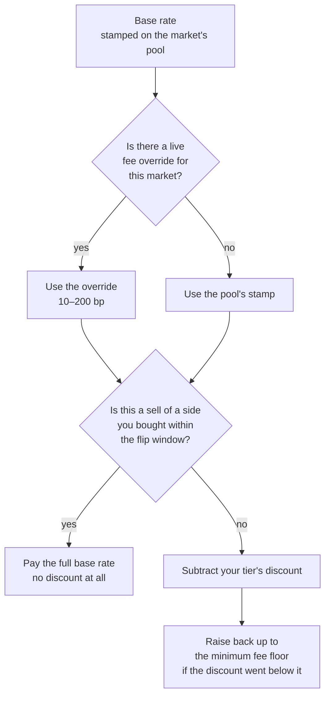

# Prices and fees

This page is the arithmetic. It is the most detailed page in the guide, and it is worth
reading slowly, because every other money page rests on it. No algebra is assumed — each
step is worked with real numbers.

Two rules govern everything below, and they are worth stating up front because they
explain every rounding decision you are about to see:

1. **No decimals anywhere.** Every amount is a whole number of millionths. There are no
   fractional cents drifting around; there are only integers.
2. **Every rounding goes the house's way.** Fees round *up*. Payouts round *down*. The
   pool keeps the crumbs. This is not greed — it is the only rounding direction that
   cannot slowly leak money out of a system doing millions of divisions.

The second rule is enforced mechanically: the project forbids floating-point arithmetic
across the entire codebase with a compiler lint (`float_arithmetic = "deny"`), so a
decimal cannot get into the money path even by accident.

## Money units

All money is **micro-dollars** — millionths of a dollar. $1.50 is stored as `1500000`.
Shares are counted the same way, in **micro-shares**, so 21.1726 shares is `21172600`.

The convenient consequence: at settlement, one micro-share of yes plus one micro-share of
no is worth exactly one micro-dollar. The units line up, which is why the settlement code
can check that the shares in existence and the money in the pot are the same number.

## The fee

The fee is quoted in **basis points** (bp): one basis point is one hundredth of one
percent, so 100 bp is 1%. The published base rate is 100 bp.

The fee is taken from your gross amount before anything else happens:

> fee = ⌈gross × rate ÷ 10,000⌉ and net = gross − fee

The ceiling brackets mean *round up*. A concrete case from the test suite: 1% of 101
micro-dollars is 1.01, so the fee is **2** micro-dollars and the net is 99. You are
charged the extra fraction; the house never eats it. And because the fee is computed and
then subtracted, `net + fee` always reassembles to exactly the gross — there is no third
place for a micro-dollar to hide.

On a **buy**, the fee comes off your money before shares are minted. On a **sell**, it
comes out of the proceeds, so what lands in your balance is already net of it.

### How your personal rate is decided

Four inputs, resolved in this order by `crates/domain/src/fee_policy.rs`:

- **The pool's stamp** is set when the market is created and never repriced afterwards.
  Changing the global fee configuration affects new markets only; an open book keeps the
  rate it was born with.
- **The override** is a per-market emergency lever with a hard range of 10–200 bp. A
  malformed override value is a typed error, never silently treated as "no override" —
  corrupt configuration must not quietly reprice a money path.
- **The flip rule** and **the tier discount** are explained on
  [Scoring and reputation](../start-here/scoring-and-reputation.md).
- **The floor** is the last word. Even a maximum discount cannot take the fee below
  `min_fee_bps`.

## A buy, worked completely

Start with a fresh, symmetric pool: 1,000 yes shares and 1,000 no shares, fee 100 bp.
In the code's units that is `1_000_000_000` micro-shares on each side.

**Step 0 — the starting price.** The price of yes is the *opposite* pile divided by the
total: 1,000 ÷ 2,000 = **50.0000 cents**. Same for no. They sum to a dollar, as they must.

**Step 1 — you spend $10.** The fee is 1% of $10,000,000 micro = **$0.10**. Net: **$9.90**.

**Step 2 — the net mints complete sets.** $9.90 becomes 9.90 yes *and* 9.90 no. Both piles
grow:

- yes: 1,000 → 1,009.90 (temporarily)
- no: 1,000 → 1,009.90

**Step 3 — the pool hands you your side.** The product before was 1,000 × 1,000 =
1,000,000. The no pile is now 1,009.90, so the pool keeps just enough yes to satisfy the
rule:

> yes kept by pool = ⌈1,000,000 ÷ 1,009.90⌉ = **990.19705** shares

Rounding **up** here is what leaves the crumbs in the pool.

**Step 4 — the rest is yours.**

> your shares = 1,009.90 − 990.19705 = **19.70295 yes shares**

**Step 5 — check the numbers.**

| Quantity | Value |
|---|---|
| You paid | $10.00 |
| Fee | $0.10 |
| Shares received | 19.70295 |
| Average all-in price | 50.75 cents per share |
| Pool after | 990.19705 yes / 1,009.90 no |
| New price of yes | 50.4925 cents |
| Product before | 1,000,000.0000000 |
| Product after | 1,000,000.0007950 |

Look at the last two rows. The product did not stay the same — it went *up*, by a fraction
so small it takes seven decimal places to see. That is the ceiling in step 3 at work: the
rounding crumb stayed in the pool rather than being handed to you. Multiply that by every
trade the system will ever process and it is the reason the pool can never be slowly rounded
into insolvency.

You paid slightly more than 50 cents a share even though the price started at exactly 50.
That gap is **slippage** — the price moved against you as you bought, which is exactly
what "prices move with demand" means when you are the demand.

## The same trade in a skewed market

Now a market where the crowd is bearish, so yes is cheap. The pool holds 770 yes and 230
no, which prices yes at 230 ÷ 1,000 = **23.0000 cents**. You buy $5 of yes at 100 bp:

| Quantity | Value |
|---|---|
| Fee | $0.05 |
| Net minting complete sets | $4.95 |
| Shares received | **21.1726** |
| Average all-in price | **23.62 cents** |
| Pool after | 753.7774 yes / 234.95 no |
| New price of yes | 23.7628 cents |

This is the trade used in the [worked example](../index.md#a-worked-example) and in
[Placing a trade](../walkthroughs/trade.md). If the market settles at 41% yes, those
21.1726 shares pay 21.1726 × $0.41 = **$8.68**.

## Selling

Selling is the same rule run backwards, and it is genuinely harder arithmetic: you hand
shares back to the pool, and the pool must burn a matching number of complete sets to pay
you. Finding how many requires solving a quadratic equation, which the code does in
integers using an integer square root — no floating point, so the answer is exactly
reproducible on any machine.

Then it does something you would not do by hand: after taking the floor of the answer, it
checks whether the multiply-the-piles rule still holds, and if it does not, it decrements
by one and checks again. In practice this loop runs at most twice. The point is that the
invariant is *verified*, not assumed to survive the rounding.

Two guards on sells:

- **A sell that would empty the opposite pile is refused** outright, with a specific
  "would drain the pool" error.
- **A sell too small to produce even one micro-dollar of proceeds is refused**, rather
  than silently taking your shares for nothing.

One property is proved by a randomised test rather than argued: buying and immediately
selling back is **never profitable**, even with the fee set to zero. Pure rounding cannot
be farmed.

## Limits on size

The pricing code refuses inputs and *results* above a hard ceiling of `1_000_000_000_000_000`
micro — a billion dollars, or a billion shares. The result matters as much as the input:
a trade that is individually within the cap but would push a pool reserve past it is also
refused. That makes the ceiling a property of every reachable state, not just of every
request, which is what lets the rest of the arithmetic run in a wide integer type with a
proof that it cannot overflow.

## Settlement arithmetic

At settlement, the final vote percentage is converted to a pair of redemption values:

> yes pays (percentage × $0.01) and no pays the remainder of $1.00

At 41%: yes pays 410,000 micro (41 cents), no pays 590,000 micro (59 cents). They always
sum to exactly 1,000,000.

Each holding is then paid `shares × redemption ÷ 1,000,000`, floor-rounded. Floor-rounding
thousands of holdings leaves a small remainder — the code calls it **dust**. It is
assigned explicitly to the fee account as a line item, and the settlement is rejected
outright if dust is not smaller than the number of holdings, which is the tightest bound
floor-rounding can possibly produce. In other words: the code proves the remainder is
made of rounding crumbs and nothing else.

## Where to go next

- [The ledger](ledger.md) — where the money these numbers describe actually sits.
- [Placing a trade](../walkthroughs/trade.md) — the trade as a sequence of steps.
- [Getting paid](../walkthroughs/payout.md) — settlement, entry by entry.
