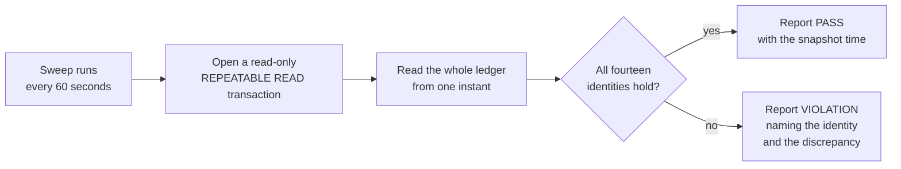

# Rules that can never break

An **invariant** is a statement that must be true at every instant. Not "usually true", not
"true after the nightly job" — true now, and true after every single operation.

The project has exactly **fourteen** of them, and a job that re-checks all fourteen across
the whole ledger every sixty seconds. If any of them is off by one micro-dollar — one
millionth of a dollar — the sweep reports a violation naming the identity and the
discrepancy.

The list below is the real one, in the order the sweep evaluates it, with the names it uses
in `crates/application/src/integrity/invariant_sweep.rs`.

## The seven ledger identities

### 1. `per_txn_sum_zero`
No historical transaction fails the balance rule. The database already refuses to commit an
unbalanced one, and the code already refuses to construct one — this checks the whole
history anyway, because a rule enforced in two places and verified in a third is a rule you
can rely on.

### 2. `non_external_non_negative`
No account of any class except External holds a negative balance. Not a user balance, not a
market's escrow, not fees, not the withheld or suspense accounts.

### 3. `external_mirrors_internal`
> The external account's balance, negated, equals the sum of every internal account.

This is the big one. In plainer words: **every dollar that ever entered is somewhere.** In
somebody's balance, in a market's pot, in fees, in house funds, held for a withdrawal,
waiting in deposit suspense, or backing promotional credits. There is nowhere else for it to
be, and this single subtraction proves it.

### 4. `payment_facts_paired`
Every real-world payment fact — a blockchain deposit or withdrawal — pairs one-to-one with
a ledger movement across the External boundary, and vice versa. No ghost credits; no
unrecorded sends.

### 5. `escrow_history_zero`
Every market that has recorded its closing collateral has drained its escrow account to
exactly zero. The "collateral at close" fact is written inside the same transaction as the
settlement, so a settled market with a non-zero residual is a contradiction the sweep will
find.

### 6. `job_idempotency`
No terminal job effect — a payout, a settlement, a notification fan-out — was produced more
than once, even though every one of those machines is designed to retry.

### 7. `receivables_reconcile`
For each reversal that opened receivables: the total opened equals exactly the shortfall the
house covered in that transaction, and collections plus write-offs never exceed what was
opened. You cannot collect a debt twice, and you cannot forgive more than was owed.

## The seven money-path identities

These were added in Phase 7, alongside deposits, withdrawals and credits.

### 8. `deposit_suspense_sigma`
The deposit-suspense account's balance equals, exactly, the sum of deposits that have been
observed but not yet resolved — those awaiting admission, on compliance hold, or awaiting
or undergoing a refund. Not "at least"; equals.

### 9. `bonus_reserve_coverage`
The bonus-reserve balance is at least the sum of every unconverted real-money credit lot's
outstanding promise. A credit somebody has earned can always be paid, because the cash was
set aside when the credit was granted rather than when it was claimed.

This is an inequality rather than an equality, deliberately: the reserve may hold more than
it currently owes.

### 10. `withdrawal_hold_matches_active`
The withheld account's balance equals the sum of withdrawals that currently hold funds —
those requested and not yet released or settled. Every micro-dollar sitting in withheld is
attributable to one specific withdrawal.

### 11. `withdrawal_hold_exact`
Every accepted withdrawal's hold is for exactly the requested amount. Not approximately;
not net of anything.

### 12. `withdrawal_terminal_xor`
Every withdrawal that has finished has **exactly one** ending: either the money went back
to the user (released) or it went out to the blockchain (settled). Never both, never
neither, never for a different amount than was requested, and never for zero.

The exclusivity is also a database constraint — but this identity checks it across the
whole history, including the amounts, which a row constraint cannot.

### 13. `withdrawal_attempt_lineage`
No payment has more than one finalised send attempt, ever. And every settled withdrawal has
exactly one finalised attempt and a recorded settle transaction — you cannot be marked paid
without proof that a payment landed.

### 14. `withdrawal_no_duplicate_terminal`
No two withdrawals share a settle transaction or a release transaction. Each ending belongs
to exactly one withdrawal.

## How the checking works

The snapshot matters. The sweep opens a **repeatable read, read only** transaction, which
means everything it reads comes from one instant in time. Without that it could read half
the ledger before a trade and half after, and report a phantom imbalance that would train
everyone to ignore the alarm.

The report is also available on demand at `GET /admin/invariants`, which is how the test
swarm checks the books during quiet moments of a run.

!!! warning "What "reports a violation" means today, precisely"
    The sweep runs only when the server is started with `--continuous`. On a failure it
    prints a detailed violation record to the process log, and it is deliberately **not**
    fatal — a single bad reading should not take the service down.

    It also opens a real incident. There is a full incident system: a durable alert outbox
    with deduplication inside an open incident, acknowledge and resolve steps, re-paging
    after a recovery, and a delivery pump that runs every minute. It defines named
    detectors including `invariant_breach`, `reconciliation_residual`, `reserve_coverage`,
    `stuck_send_unknown`, `stuck_screening` and `aml_flag`. A failing identity now opens a
    durable `alert_outbox` incident through that system, deduplicated within the episode it
    already opened, and a recovering identity resolves it so that a recurrence pages again.
    The database enforces the deduplication itself, with a partial unique index, because two
    concurrent raisers could otherwise each read "no open incident" and each insert one.

    What is still missing is the last hop. The alerter the system is wired to **records**
    pages in process; it does not send them anywhere. The durable row in `alert_outbox` is
    the operator-visible artefact, and reading it is a deliberate act by a human who already
    decided to look. So a breach is now durably recorded and deduplicated, but **nothing
    reaches a phone**. Delivering to a real pager is unbuilt work, and it is named as a
    launch blocker rather than quietly assumed. Saying "a human is paged" would be exactly
    the kind of claim this guide is meant not to make.

## Reconciling against the real world

The ledger being internally consistent is not enough: the blockchain wallet must actually
contain the money.

So a second check compares the ledger against the real on-chain balance, at one pinned
finalised point in the chain's history:

> wallet balance = −(external balance) − payments finalised on-chain but not yet settled in
> the ledger + deposits observed on-chain but not yet booked

Anything left over is the **residual**, and a residual of even one micro-dollar in either
direction is a page.

There is a subtlety worth calling out. A payment that has been *broadcast* but not yet
confirmed is **not** subtracted. It might land, it might not. Treating it as gone would
generate a false alarm during perfectly normal operation. It is reported separately as
**exposure** — visible, tracked, but never confused with a discrepancy. Confusing "in
flight" with "missing" is how monitoring systems train their operators to ignore them.

Both observation points — which chain slot the wallet was read at, and which database
snapshot the ledger was read at — are recorded on the reconciliation, so a page can be
reconstructed rather than argued about.

## Why this many checks

Every one of these was written because someone asked "what if?" during design review and
could not answer it.

The reviews on this project were adversarial by design: two independent AI reviewers with
different instructions — one hunting correctness, one hunting economic exploits — were
asked to break each plan before any code was written. Several of these invariants exist
because a reviewer found a way to make money appear or disappear that the original plan
permitted. Identity 7, the receivables reconciliation, exists because of exactly such a
finding. So does identity 9's reserve-at-grant rule.

## Where to go next

- [The ledger](ledger.md) — what these identities are checking.
- [Deposits and withdrawals](deposits-and-withdrawals.md)
- [Tests and quality gates](../running/tests-and-gates.md)
