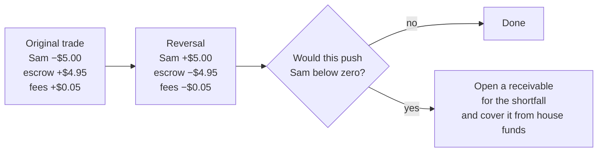

# The ledger

The ledger is the heart of the system. If you understand this page you understand why the
money can be trusted.

## The idea is 500 years old

Double-entry bookkeeping was described by a Franciscan friar in 1494 and it is still the
best idea in accounting. The rule:

> **Money never appears or disappears. It only moves. So every record of a movement lists
> both ends, and the two must cancel out to zero.**

If you deposit $20, the ledger does not say "Sam +$20". It says:

| Account | Amount |
|---|---:|
| The outside world (external) | −$20.00 |
| Deposit suspense | +$20.00 |
| **Sum** | **0** |

The outside world went down by 20 because 20 left it. Suspense went up by 20. Zero.

And when the compliance checks clear, a second, separate transaction:

| Account | Amount |
|---|---:|
| Deposit suspense | −$20.00 |
| Sam | +$20.00 |
| **Sum** | **0** |

## The nine account classes

| Class | How many | Holds |
|---|---|---|
| **User** | one per person per currency | Their spendable balance |
| **Escrow** | one per market | Money backing that market's shares |
| **Pool** | one per market | The house's own share inventory for that market |
| **Fees** | one, per currency | Where trading fees and settlement dust accumulate |
| **House** | one, per currency | The operator's own funds — seeds markets, covers shortfalls |
| **External** | one, per currency | The contra account for the outside world |
| **Withheld** | one, per currency | Money in a requested-but-not-yet-sent withdrawal |
| **Deposit suspense** | one, per currency | Money that has arrived but is not yet approved for spending |
| **Bonus reserve** | one, per currency | Pre-funded backing for promotional credits |

**External** is the odd one, and worth understanding properly. It represents everything
outside the system. It is the only account allowed to go negative, and its negative balance
is *exactly* the amount of money currently inside the system. That is not a quirk; it is
what makes "does everything add up?" a single subtraction rather than a survey.

There is no genesis backdoor. Even the house's initial capitalisation is an ordinary
balanced transaction against External.

## Two currencies that never mix

Every account is denominated in one of two currencies: `usdc` (real, withdrawable cash) and
`usdc_credit` (promotional balance that cannot be withdrawn).

The balancing rule applies **per currency inside a single transaction**, not to the total.
That is a much stronger rule than it sounds. Taking one grand total would let a transaction
move $1 out of a credit account and $1 into a cash account and still "balance" — which is
exactly the conversion the separation exists to forbid. A credit becomes cash only through
a specific, audited conversion path, never as a side effect of some other movement.

The database trigger that enforces this groups by the currency of each account before
summing. It was written that way on the second review round, after the first version's
transaction-wide sum was pointed out as readmitting exactly that hole.

## A trade, in ledger terms

Sam buys $5 of yes shares at a 1% fee:

| Account | Amount |
|---|---:|
| Sam | −$5.00 |
| Market escrow | +$4.95 |
| Fees | +$0.05 |
| **Sum** | **0** |

Two things to notice. Sam's money did not vanish into "the system" — it is sitting visibly
in that market's escrow and in the fee account. And the fee is not a hidden deduction; it
is a line item anyone can audit.

A zero-valued leg is *omitted* rather than written as zero — the domain and the database
both forbid a zero-amount entry. So a trade on a market with a zero fee has two entries,
not three.

## Money is stored as whole numbers

All amounts are **micro-dollars** — millionths. $1.50 is stored as `1500000`.

This matters more than it sounds. Computers store decimal fractions approximately: add 0.1
to 0.2 in most languages and you get 0.30000000000000004. Do that a million times across a
million trades and real money goes missing. Whole numbers cannot drift.

The project does not merely prefer integers, it forbids the alternative: floating-point
arithmetic is denied workspace-wide by a compiler lint. A developer cannot introduce a
float into the money path by accident, because the build stops.

Where a division does not come out even, the leftover is assigned explicitly — to fees at
settlement, or kept by the pool in a trade — rather than being rounded away into nowhere.

## Nothing is ever edited

The ledger is **append-only**. There is no update and no delete; a database trigger raises
an exception on any attempt. If something must be undone, a *reversing transaction* is
added — the mirror image of the original — and both remain visible forever.

That right-hand branch is real, and it is the part most designs miss. If a market is
unwound after someone has already sold up and withdrawn, reversing their trade would take
their balance negative — which the ledger forbids. So the shortfall becomes a **receivable**:
a tracked non-cash record of what they owe, covered in the meantime from house funds. It
can later be collected or explicitly written off with dual control, but it can never be
quietly forgotten. There is a dedicated invariant checking that the receivables opened
against a reversal add up to exactly the shortfall the house covered.

## The database is the last line of defence — for some rules

You might expect the "must sum to zero" rule to live only in the code. It lives there —
and *also* as a deferred constraint trigger inside PostgreSQL, checked when the transaction
commits.

That redundancy is deliberate. If a bug, a bad migration, or someone with a database
console tried to write an unbalanced set of entries, the database would reject the whole
thing. The rule does not depend on the application being correct.

!!! warning "But not every rule works that way"
    The non-negative-balance rule is enforced by the application, not by the database.
    Balances are derived by summing entries — there is no stored balance column and no
    constraint on it. The check happens in the domain, and again in the PostgreSQL adapter
    under a row lock on every account the transaction touches. That lock is what makes it
    correct when two withdrawals race for the same balance. But it *is* application code,
    and the continuous invariant sweep exists partly to catch anything that gets around it.
    See [Where the data lives](../build/the-database.md).

## Locking, and why the order is fixed

Two people trading in the same market at the same moment could interleave badly. To stop
that, operations take **locks** — temporary exclusive claims on rows.

The catch: if operation A locks the user then the market, and operation B locks the market
then the user, they can freeze forever waiting on each other. That is a **deadlock**.

The project prevents it with one rule, applied everywhere: **claim the idempotency key
first, then lock the user, then the market, then the pool, then accounts in id order.**
When an operation needs many user locks at once — settlement, unwinding — it enumerates the
users, sorts them, and locks them in that sorted order rather than opportunistically.

## Where to go next

- [Prices and fees](fees-and-pricing.md) — the arithmetic behind the numbers in the entries.
- [Rules that can never break](invariants.md) — the continuous checks over this ledger.
- [Deposits and withdrawals](deposits-and-withdrawals.md) — money entering and leaving.
- [Getting paid](../walkthroughs/payout.md) — settlement, entry by entry.
