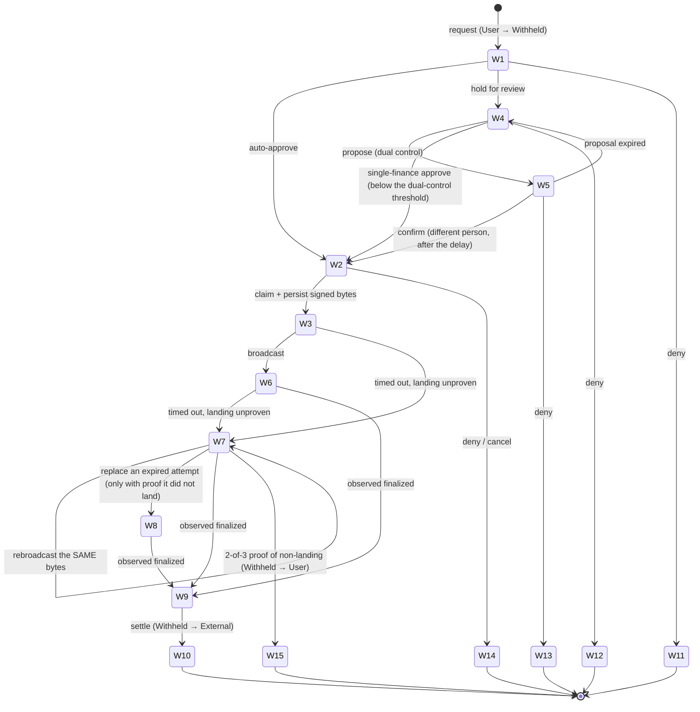

# The fifteen withdrawal states

Paying money out is the single most dangerous thing this software does. Every other
mistake is recoverable inside the system; this one leaves the building.

So the withdrawal path is not written as ordinary code with some checks in it. It is
written as an explicitly enumerated **state machine** whose legal states are listed in a
document, implemented as a database constraint, and enforced on every single change. This
page is the plain-English version of that table.

## Three dimensions, not one

A withdrawal's state is a combination of three columns:

- **status** — the coarse, user-facing state: `queued`, `risk_hold`, `sent`, `settled`,
  `denied`, `failed`
- **review_state** — where the *decision* stands: `screening`, `approved`,
  `review_required`, `approval_proposed`
- **send_state** — where the *payment* stands: `unsent`, `sending`, `broadcast`,
  `unknown`, `finalized`, `definitive_failed`

Three columns with those options would allow 144 combinations. **Fifteen are legal.** The
other 129 are rejected by the database, by name, in a check constraint.

Why bother splitting it into three? Because collapsing them would hide which thing is
true. "Sent but we do not know whether it landed" and "sent and confirmed but not yet
booked" are genuinely different situations that demand different actions, and a single
status column would either merge them or grow to fifteen values with no structure.

Alongside the three columns, three transaction links: a **hold** (mandatory on every
accepted row), a **release** (money returned to the user) and a **settle** (money left for
the chain). The constraint enforces that release and settle are never both present.

## The fifteen legal states

| ID | status | review | send | Meaning |
|---|---|---|---|---|
| **W1** | queued | screening | unsent | Just requested. Funds already held. No decision yet. |
| **W2** | queued | approved | unsent | Approved — automatically, or by a human, or by two humans. Not yet claimed for sending. |
| **W3** | queued | approved | sending | A sender has claimed it and **persisted the signed bytes**. Nothing broadcast yet. |
| **W4** | risk_hold | review_required | unsent | Not auto-approved. Waiting for a person. |
| **W5** | risk_hold | approval_proposed | unsent | One person has proposed approval; a second must confirm. |
| **W6** | sent | approved | broadcast | The bytes are on the network. Not yet final. |
| **W7** | sent | approved | unknown | We do not know whether it landed. Funds stay held. This state pages. |
| **W8** | sent | approved | sending | A replacement was prepared after the original expired without landing. |
| **W9** | sent | approved | finalized | Confirmed on-chain. The settle has not been committed yet — this is the crash window. |
| **W10** | settled | approved | finalized | **Done.** Money moved from withheld to external. |
| **W11** | denied | screening | unsent | Refused during screening. Hold released. |
| **W12** | denied | review_required | unsent | Refused by a reviewer. Hold released. |
| **W13** | denied | approval_proposed | unsent | The proposal was rejected. Hold released. |
| **W14** | denied | approved | unsent | Approved, then cancelled before sending. Hold released. |
| **W15** | failed | approved | definitive_failed | Proven not to have landed. Hold released. |

Read down the last column and you can see the whole safety property: **funds are held from
W1 onward, and there are exactly two ways out** — released back to the user (W11–W15) or
settled out to the chain (W10). Nothing else terminates.

## The path through

Every arrow on that diagram is a **compare-and-set**: a single-row update that names the
exact state it expects to find. If another process moved the row first, the update matches
nothing and the caller learns it lost the race, rather than overwriting somebody else's
work. Each one also writes an append-only event row, an audit fact when a human did it, and
an outbox event — in the same transaction as any money movement.

## The four dangerous moments

### Between "approved" and "signed" (W2 → W3)

The sender takes a **lease** — a time-boxed claim — before doing anything, so two servers
cannot both start sending the same withdrawal. Then it signs the payment and **writes the
exact signed bytes to the database before broadcasting anything.**

That ordering is the whole trick. It means the recovery question is never "should I sign a
new one?" — it is always "did *this specific* payment land?"

### Between "signed" and "broadcast" (W3)

Crash here and the row is stuck at W3 with a lease that will expire. When it does, recovery
does a **signature lookup first**:

- Found on-chain → it *was* broadcast; move to W6.
- Not found, and the transaction's validity window is still open → reclaim and rebroadcast
  **the same persisted bytes**. Never a fresh signature.
- Not found, and the window has expired → move to W7 and let the proof rules below decide.

A second prepared attempt is never created while the first is still live. The database
enforces this with a partial unique index, so it is not a matter of the code remembering.

### Between "broadcast" and knowing (W6 → W7)

Networks time out. A payment might have landed. The software therefore has **three**
outcomes, not two:

| Outcome | Meaning | Action |
|---|---|---|
| **finalised** | Confirmed on-chain, with a verified receipt | Settle it |
| **definitively failed** | Proven not to have landed | Release the hold |
| **unknown** | We genuinely do not know | Keep holding, keep asking, page a human |

Declaring failure requires **proof**, and the bar is specific: agreement from **two of
three independent** archival blockchain sources that the transaction's validity window has
passed *and* the signature does not exist. If the sources disagree, if one has pruned its
history, or if one times out — the answer stays `unknown` and the money stays held.

A single lagging server saying "not found" is not proof. That distinction is the difference
between a stuck withdrawal and a double payment.

### Between "finalised" and "settled" (W9 → W10)

Crash here and the money has left the chain but the books do not say so. Recovery re-runs
the settle under a fixed idempotency key, so it either completes or replays — and invariant
13 checks the whole history for exactly this: a settled withdrawal must have exactly one
finalised attempt behind it.

## What gets you approved automatically

A withdrawal is auto-approved only if **everything** is clean. Any single reason moves it to
human review. The seeded thresholds are:

| Condition | Seeded value |
|---|---|
| Minimum withdrawal | $5 |
| Maximum single withdrawal | $1,000 |
| Auto-approve below | $50 |
| Dual control at or above | $500 |
| Rolling 24-hour limit, per user | $2,000 |
| Rolling 24-hour limit, per destination address | $1,000 |
| Rolling 24-hour limit, hot wallet total | $10,000 |
| Required identity tier | 2 |

Plus a fresh clear on both screenings, no open anti-money-laundering flag, an unbanned and
non-self-excluded account, and a **warm** destination.

### What makes a destination "warm"

An address the system has never successfully paid before does not qualify for automatic
approval. Becoming warm requires all of:

- at least **$100** already **settled** to it — pending does not count;
- at least **72 hours** since the first settlement to it;
- it is not shared with another user;
- it is not a refund destination.

The floor and the delay together close a specific attack: warm an address up with a
one-cent payment, then drain to it. You cannot, because the floor is a hundred dollars and
you have to wait three days.

### Daily limits count settled withdrawals too

An early design counted only in-flight withdrawals against the daily cap. A reviewer spotted
the hole immediately: request the daily maximum, wait for it to settle, request it again.
Repeat.

The rule now counts **every request in the rolling 24-hour window** except ones that were
denied or provably failed — settled ones very much included.

## Two more honest details

**Screening happens before the lock, then again after it.** The request protocol looks up
the request fingerprint without any lock, calls out to the remote geo and sanctions
providers (a network call inside a database transaction would be a disaster), *then* claims
the idempotency key, locks the user, and revalidates everything under the lock. Nothing
approved is based only on the pre-lock read.

**A repeated request replays, it does not stack.** The fingerprint is the combination of
user, amount, and canonical destination. A matching repeat returns the original receipt —
including a persisted *refusal* — and writes nothing.

**A market unwind can cancel an unsent withdrawal, but not a sent one.** If unwinding a
market needs to claw back money that is sitting in a withdrawal hold, it can cancel
withdrawals in W1, W2, W4 or W5. Once the payment has been claimed for sending (W3 onward)
it is outside the reach of the unwind, and the shortfall becomes a receivable instead.

## Where to go next

- [Deposits and withdrawals](deposits-and-withdrawals.md) — the reasoning behind the design.
- [Rules that can never break](invariants.md) — the five identities that watch this machine.
- [Keeping it legal and safe](compliance.md) — the screening rules it consults.
