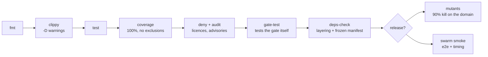

# Tests and quality gates

This project is unusually strict about verification. This page explains each gate, what it
protects, and why the bar is set where it is.

## The gates

`just ci` runs all of them:

```
ci: fmt clippy test coverage deny audit gate-test deps-check
```

| Command | Checks |
|---|---|
| `cargo fmt --all --check` | Formatting is uniform. Removes style arguments entirely. |
| `cargo clippy --workspace --all-targets -- -D warnings` | Rust's linter, with **every warning treated as an error**, across every target including tests. |
| `just test` | The whole test suite, serialised so the database-backed tests do not collide. The last recorded full run was 1,027 tests across 23 binaries. |
| `just coverage` | **100% line coverage** on four packages, with **zero exclusions**. |
| `cargo deny check` | Dependency licences and advisories. |
| `cargo audit` | Known vulnerabilities in dependencies. |
| `just gate-test` | Tests the mutation gate itself — see below. |
| `just deps-check` | The layering rule, the frozen manifest, the no-database-types-in-application rule, and the confinement of HTTP clients to three audited files. |

Not in `just ci`, but part of the release bar:

| Command | Checks |
|---|---|
| `just mutants` | At least 90% of deliberately introduced bugs in the domain are caught by tests. |
| `scripts/e2e_swarm_smoke.sh` | The full end-to-end run against a live server and database. |
| `just branch-coverage` | Branch coverage on the domain, on a nightly toolchain — reviewed, not gating. |



The lint configuration is worth reading on its own. Workspace-wide, the project **forbids**
unsafe code and **denies** `unwrap`, `expect`, `todo`, debug macros, and — most unusually —
all floating-point arithmetic. The no-floats-in-money rule is not a convention anyone has to
remember; it is a compiler error.

## Why 100% coverage, with no exceptions

Coverage targets like 80% sound reasonable and are nearly useless: the missing 20% drifts to
exactly the error paths nobody tests, which are precisely the paths that matter when money is
involved.

The rule here is 100% on `domain`, `application`, `adapters` and the `simswarm` library —
and, importantly, **no exclusion list**. The moment a file can be excluded, the hard cases
move into excluded files.

The one package not measured is `main`, which contains only wiring, and the justification is
written in the file's own first line: *any logic in `main` is a review-blocker*. It is
excluded because it is supposed to have nothing worth testing, and if that ever stops being
true the exclusion becomes a bug.

!!! note "A tooling artifact that cost real hours, three times"
    The coverage tool's human-readable summary sometimes reports lines as uncovered that the
    detailed data shows are covered. It happens when the same code is compiled into more than
    one binary — the ordinary build and the test build of the same file. The summary folds
    those records by taking the **maximum** of covered-or-not rather than the **union**, so a
    line exercised by only one of them is reported as missed.

    Because that under-reports, the gate does not use the summary. It exports the detailed
    line data and asserts on the union (`scripts/coverage_gate.py`): **zero uncovered lines,
    no exclusions.** The summary is still printed for humans; the union is what fails the
    build.

    Worth noticing that the fix made the gate *stricter*, not looser. The easy response to
    "the tool is wrong" is an exclusion; the response taken was to measure honestly.

## The mutation gate, and the gate on the gate

Coverage tells you a line ran. It does not tell you a test would have *noticed* if the line
were wrong.

Mutation testing does. A tool systematically introduces small bugs into the domain — flips a
comparison, changes a constant, deletes a statement — and re-runs the tests. Every mutant the
tests fail to catch is a place where the coverage is theatre. The bar is 90% caught.

The interesting part is `just gate-test`, which tests the gate itself against four fixtures:
a passing run, a failing run, a timed-out run, and an **empty** one. All three of the last
three must be rejected.

That empty fixture is the point. The classic way a quality gate becomes decorative is that it
silently starts measuring nothing and keeps reporting success. This project made "measures
nothing" an explicit failure, and then wrote a test to prove it stays that way.

## The kinds of tests

**Unit tests** — the pricing arithmetic, the settlement maths, the state machines, the
scoring formula. Fast, no database. They live in the same file as the code they test.

**Property tests** — thousands of randomly generated inputs asserting a rule rather than a
case. Examples actually in the codebase: the constant-product invariant never decreases on a
buy; a buy followed immediately by a sell is never profitable even at zero fee; the two
prices always sum to a dollar within one micro; a no-side trade is exactly the mirror of a
yes-side one; a settlement always conserves escrow with bounded dust; a fee split always
reassembles to the gross.

**Contract suites** — one set of tests run twice: once against the in-memory fake, once
against real PostgreSQL. This is what keeps the fast fake honest.

**Concurrency tests** — two operations racing deliberately: two withdrawals against one
balance, a trade against a settlement, a credit conversion against a market unwind. These are
the tests that found the real deadlock in this codebase — by hanging, which is the honest
symptom.

**Chaos tests** — the process is killed at the most dangerous instant. There is an injected
crash point with exactly one call site, immediately after the payout ledger write, and
recovery must be provably exactly-once. There are also fault switches that delay the outbox
relay and drop every Nth WebSocket frame.

**The swarm** — up to two thousand simulated users, driving only the public API. See
[The swarm](the-swarm.md).

## Red-team tests: the ones that must fail

A specific and unusual category. These tests assert that an attack **does not work**:

- Wash-trade to run up fee volume after a bonus grant → the bonus does **not** convert,
  because provisional fee progress is not finalised progress.
- A market that voids → the fee allocations never finalise, so the bonus still does not
  convert.
- Two accounts sharing one verified phone number → at most one becomes grant-eligible.
- A deposit from an account that fails compliance → lands in suspense, never spendable.
- A withdrawal to an address warmed by a tiny payment → still requires review, because
  warmth needs both a floor amount and elapsed time.
- A withdrawal whose destination is shared with another user, or is a refund address → never
  warm.
- A trade without the configuration stamp → refused before a transaction opens.
- A configuration change proposed and confirmed by the same token id → rejected, by the
  database as well as the code.
- A coordinated voting ring → the integrity sweep's signals fire.

Each exists because a reviewer described exactly how they would exploit the design *before*
it was built.

## Service-level targets

The swarm is not only about correctness — it is about timing. The release profile enforces:

| Measure | Target |
|---|---|
| Trade confirmation | 95th percentile under **300 ms** |
| Market close → everyone paid | 99th percentile under **1 second** |
| Live update delivery | 95th percentile under **100 ms** |

Those three numbers are constants in the swarm library, so the gate and the documentation
cannot drift apart.

And there is a rule that stops the classic cheat: **a measurement series with fewer samples
than expected fails.** Before checking any percentile, the gate checks that enough
observations exist at all. An empty series is not a pass; it is a missing test. This is the
same principle as the empty-fixture check on the mutation gate, applied to performance.

## The frozen manifest

A list of 58 files — migrations, shared ports, the composition root, the HTTP router — that
only the coordinating role may change, tracked by SHA-256 checksum.

During construction several AI agents worked in parallel on separate areas of the same
working tree with no version control to fall back on. This file caught several accidental
cross-edits before they could cause a conflict that nothing could undo.

## Where to go next

- [The swarm](the-swarm.md) — the biggest test in the project.
- [How this was built](how-this-was-built.md) — why the bar is set here.
- [Rules that can never break](../money/invariants.md)
