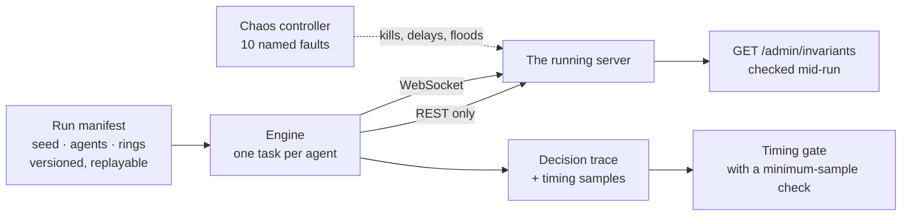

# The swarm

The largest test in the project is a program that pretends to be two thousand people.

It is called **simswarm**, it lives in `crates/simswarm`, and the project's decision log
names it as the release gate: nothing ships unless the swarm run is green. This page
explains what it actually simulates and why it is built the way it is.

## The one rule that makes it a real test

The swarm drives the system **only through the public REST and WebSocket API**. It has no
internal dependency on any other package in the workspace — the dependency-rule script gives
it an empty allow-list, so it *cannot* reach into the database or call a use case directly
even by accident.

That constraint is what makes the results mean something. A test harness with a private back
door tests the harness's idea of the system. This one has to sign up, verify a channel, vote,
and trade exactly like a person, through the same endpoints, hitting the same locks and the
same rate limits.

It does not even share type definitions with the server. The wire shapes are declared
separately inside the swarm, and a contract test checks them against the generated API
description. If the server's API drifts, the swarm's copy fails to match — it does not
silently adapt.

## What it simulates

### Two profiles

| Profile | Agents | Purpose |
|---|---:|---|
| `smoke` | 100 | Runs on every merge |
| `full` / `2k` | 2,000 | The release gate; also turns on the timing enforcement |

### Seven personas

Six make up the ordinary load mix, assigned round-robin:

| Persona | Behaviour |
|---|---|
| **Whale** | Buys $25 at a time |
| **Small dabbler** | Buys $1 at a time |
| **Voter only** | Votes with a random crowd guess and never trades |
| **Close-window sniper** | Sits idle until the last two minutes, then buys $5 |
| **Panic seller** | Sells when the yes price drops below 40 cents, buys otherwise |
| **Noise** | A third votes, a third makes a small buy, a third does nothing |

The seventh, **money path**, is deliberately *not* in the round-robin. In the release profile
it is pinned to exactly every tenth agent — 10% of the roster — and two thirds of its
opportunities request a $5 withdrawal while the rest observe. Pinning it rather than mixing
it in keeps the ordinary load mix unchanged between profiles, and rationing it stops 200
agents from flooding the hot-wallet daily cap in the first minute.

### Six attack rings

This is the part that makes the swarm more than a load test. Alongside the honest agents,
the manifest pins six coordinated attacker groups, each sharing a device identifier and a
network address, each aimed at a specific market:

| Ring | What it tries |
|---|---|
| **Aged sybil** | 31 accounts, aged past the new-account friction, voting together in the market with the biggest pot |
| **Wash pair** | Two accounts trading against each other to manufacture fee volume — with one of them seeded to a mid reputation tier so it gets the discount |
| **Void suppress** | Withholding votes to push a market below its participation minimum and force a void |
| **Threshold pad** | Adding just enough votes to push a market *over* the minimum |
| **Referral chain** | Accounts referring each other in a loop |
| **Bonus wash** | Wash trading specifically to convert a promotional credit, with a stated fee volume deliberately larger than the credit so that a failure to convert proves the *finalise-at-Paid* rule rather than merely thin volume |

That last parenthesis is the kind of care worth pointing at. It would be easy to write a
bonus-wash test that passes for the wrong reason — the bonus does not convert because the
attacker did not trade enough. Sizing the attack *above* the threshold means the only
remaining explanation for a non-conversion is the rule the test is meant to prove.

The rings' members are excluded from the honest voter rosters, so an attack cannot
accidentally be counted as the baseline it is being measured against.

## Determinism

A test that behaves differently every run cannot be debugged. The swarm is built to be
reproducible:

- A **run manifest** — a versioned document listing every agent, every ring, the seed, and
  the decision-logic version — is generated up front and can be written to a file, inspected,
  and replayed.
- Randomness comes from a seeded, counted generator. Every persona declares how many random
  words one decision consumes, so the stream stays aligned even when personas make different
  choices.
- `--dry-run` produces the planned opportunities without touching a server.
- `--replay-log` re-runs a recorded set of decisions and checks the result matches.
- Wall-clock time is behind a port, so a test can drive it.

## Chaos

Ten named fault scenarios, kept as a typed list precisely so that a shell script cannot
silently skip one by misspelling it:

| Scenario | What it breaks |
|---|---|
| `clock_jump` | The system clock moves suddenly |
| `terminate_postgres` | The database dies mid-run |
| `disk_full_render` | The disk fills while rendering a market's assets |
| `webhook_storm` | A flood of inbound webhooks |
| `duplicate_webhook` | The same webhook delivered twice |
| `reconciler_kill_heal` | The configuration reconciler is killed and must heal |
| `simultaneous_close` | Several markets close at the same instant |
| `relay_delay` | The outbox relay is artificially slow |
| `ws_drop` | Every Nth WebSocket frame is dropped |
| `resolution_crash` | The process dies mid-payout, at the injected crash point |

The last one is the sharpest: the process is killed immediately after the payout ledger write
and before any subsequent write, and the restart must produce exactly one payout. That is the
difference between believing the design is crash-safe and knowing it.

All of these require the two-factor staging arm — `OPINIONS_ENV=staging` **and**
`CHAOS_ENABLED=1`. A chaos variable set without both stops the process at startup.

## Checking the books mid-flight

During quiet moments in a run the swarm calls `GET /admin/invariants` and asserts the whole
fourteen-identity suite still passes. So the money rules are not only checked before and
after — they are checked *while* two thousand agents are trading, voting, and withdrawing.

## The timing gate

In the release profile the swarm also enforces the service-level targets: 95th-percentile
trade confirmation under 300 ms, 99th-percentile close-to-paid under 1 second,
95th-percentile live-update delivery under 100 ms.

And before it checks any percentile it checks that enough samples exist. A series thinner
than expected **fails**. An empty measurement is not a pass; it is a missing test.

## What a green run prints

The end-to-end script prints a banner with the actual numbers, not just a tick — the convoy
ratio, how many lifecycle and fat-pot integrity signals fired, and how many payout
transactions were produced. The last is the one to watch: **one** payout transaction for one
settled market, even after the process was killed mid-payout.

## Where to go next

- [Tests and quality gates](tests-and-gates.md) — the other gates.
- [Rules that can never break](../money/invariants.md) — what it checks mid-flight.
- [How this was built](how-this-was-built.md)
