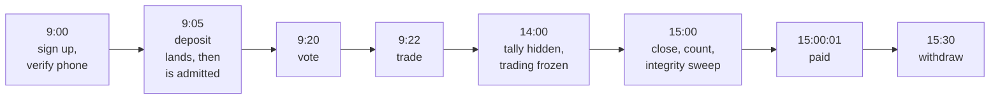

# A day in the life

The same system, told as a story. Meet Sam, who has never used the app before.

Everything Sam does below corresponds to a real code path. Where a step depends on
something the project has deliberately *not* built — a card processor, a real identity
vendor — the story says so rather than pretending.

## 9:00 — Sam signs up

Sam gets a link from a friend and creates an account, which links a phone number as a
messaging channel. Then Sam proves possession of that number: the service issues a
challenge, Sam replies with the code, and the number becomes verified.

That is not paperwork for its own sake. **One verified phone number can only ever belong
to one account**, and the database enforces it with a uniqueness rule rather than trusting
the code to remember. It is the main defence against somebody making a thousand fake
accounts to swing a vote. Without a verified messaging channel Sam cannot vote at all, and
without a vote Sam cannot trade — so the anti-sybil check sits at the very front of
everything else.

The number itself is not stored in readable form. What is stored is a one-way fingerprint
of it, stamped with a key version so the fingerprinting key can be rotated later without
losing the ability to tell old records apart.

!!! note "Promotional credits, and what they are not"
    The project supports **credits** — promotional balance in a separate currency that
    cannot be withdrawn — and they are how a signup or referral bonus would be paid. But
    granting one is an explicit, dual-controlled admin action or a referral payout, not
    something that happens automatically when an account is created. There is no
    "welcome bonus" wired into signup today.

    When a credit *is* granted, two rules apply. It converts to real, withdrawable money
    only after the holder has paid at least that much in trading fees — and only fees on
    markets that have actually finished paying out. And the house must already be holding
    the cash to honour it: the grant is refused unless a segregated reserve account
    covers it at the moment of granting, not at the moment of claiming.

## 9:05 — Sam puts in $20

Money enters as USDC — digital dollars — arriving at an address on the Solana network.

!!! warning "The onramp is not built"
    In the intended product Sam would top up with a card and an onramp provider would
    deliver USDC. That integration is an open item, listed in the project's decision log
    as gated on written vendor approvals. What exists in code is the half that starts once
    the money has arrived on-chain. Everything below is real; the card is not.

Here is the part that surprises people: **the system records the arrival before it makes
the money spendable.** Once the deposit is finalised on-chain it is written down and parked
in a holding account called deposit suspense. Only then, in a *separate* transaction, does
the software check the compliance rules — is Sam verified to the required level? in a
permitted place? clear of the sanctions screen? within the deposit limit? — and, if
everything passes, move the money into Sam's spendable balance.

Why not check first and only then record it? Because money can arrive whether or not we
approve of it. Anyone can send funds to their deposit address at any moment, and nobody
asks permission first. If the software refused to write that down, the wallet would hold
money the books did not know about, and the alarm that exists to detect actual theft
would be ringing constantly for innocent reasons. So: **always record, then decide.**

Splitting it into two transactions has a second benefit. A crash between "observed" and
"admitted" leaves a deposit sitting in a well-defined state that a later pass can pick up
and finish. A single combined step would have a window where a crash loses the inflow.

## 9:20 — Sam finds a market

*"What percent of people say a hot dog is a sandwich?"*

Sam is asked to vote first. Sam votes **no**, and guesses that 35% of everyone else will
say yes. The vote is one per market and cannot be changed.

Sam is also told a **vote number** — a sequential position in the market. That number is
shown while the tally is public, and withheld once the hidden-tally window starts, because
knowing how many people have voted so far is itself information about the answer.

## 9:22 — Sam trades

The market currently prices "yes" at 23 cents. Sam thinks the internet is going to be
weird about this and the real number will be higher, so Sam buys $5 of **yes**.

Sam sees the numbers *before* confirming: 21.1726 shares, average price 23.62 cents, fee
5 cents. That preview carries a stamp — the exact generation number of the configuration
it was calculated under. When Sam confirms, the stamp goes back with the order. If
anything relevant to *Sam's* price changed in between — the fee, the tier discount, the
position cap, a market-specific override — the trade is rejected as stale and Sam is shown
a fresh price.

The staleness check is precise rather than paranoid: it looks at which configuration keys
actually changed and whether any of them feed the number Sam was shown. An unrelated
change to, say, the comment spam limit does not invalidate Sam's quote.

Sam can never be filled at a price Sam was not shown. A trade that arrives with no stamp
at all is refused before the software so much as opens a database transaction.

## 14:00 — the tally goes dark

An hour before closing, the running percentage stops being published and trading freezes —
both buying and selling. Voting continues.

This stops the last people through the door from trading on near-certain knowledge. Note
that the concealment is enforced at the source: the server simply does not put tally
numbers into the data it sends. It is not the browser politely declining to display them.

## 15:00 — the market closes

Voting ends. The software counts: **41%** said yes.

If the pot is large enough to be worth attacking — the published threshold is $500 — the
market does not settle immediately. It moves into a reviewing state and waits a few
minutes for an **integrity sweep**, which looks for four specific statistical signals:

- a burst of votes in the final window compared with earlier windows
- an unusual share of votes from brand-new accounts
- an unusual share from one network neighbourhood
- an unusual share from one device fingerprint

Two of those four have to fire before the market is flagged. One alone is a pass, with the
measurement recorded. The two weaker signals are also skipped entirely when the software
has too little metadata to judge them honestly, rather than being computed from a sample
so thin the number would be noise.

If the market is flagged, a human curator decides: settle at the tally, or void.

## 15:00:01 — Sam gets paid

Nothing is flagged, so settlement runs. Sam's 21.1726 yes shares are exchanged at 41 cents
each: **$8.68**. Sam paid $5.

Every cent of that movement is written as a **double-entry** record — the same technique
bookkeepers have used for 500 years, where every amount that leaves one place arrives
somewhere else and the whole set must sum to zero. If it did not sum to zero, the database
itself would refuse to save it.

Everyone in the market is paid inside that one transaction, including the pool's own
leftover inventory, which is how the house learns whether it made or lost money seeding
this market.

## 15:30 — Sam cashes out

Sam asks to withdraw $25.

1. The money is moved **immediately** out of Sam's spendable balance into a holding
   account. From this second on, Sam cannot spend it on a trade while the withdrawal is
   being processed.
2. The request is screened: is Sam still verified, unbanned, not self-excluded, clear of
   anti-money-laundering flags, within the daily limit? Is this destination address one
   the system has successfully paid before?
3. A small withdrawal to a known address goes through automatically. A larger one, or a
   new address, or any open flag, waits for a human — and above a threshold, **two
   different** staff must approve, each with their own credentials, with a delay between
   the proposal and the confirmation.
4. The payment is signed and the exact signed bytes are **written to the database before**
   anything is broadcast. If the power went out mid-send, the system restarts, finds a
   signed payment with no recorded outcome, and asks the network *"did this specific
   payment land?"* — it never blindly signs a second one. That is how you avoid paying
   somebody twice.
5. Only when the network confirms the payment as final does the money leave the books.

Every one of those steps is a single-row, all-or-nothing state change against an
explicitly enumerated list of legal states. There are exactly fifteen of them, and the
database rejects any combination that is not on the list. See
[The fifteen withdrawal states](../money/withdrawal-states.md).

## What Sam never saw

- A fail-closed compliance gate consulted before every money movement, which refuses when
  it cannot confirm rather than allowing when it cannot refuse.
- A background sweep that re-checks fourteen separate accounting identities across the
  whole ledger from one consistent snapshot, and reports a violation if any of them is off
  by a single millionth of a dollar.
- A test suite that simulates two thousand Sams at once — including deliberately malicious
  ones organised into attack rings — and refuses to let the software ship if the money
  rules break or the timing targets are missed.

That invisible machinery is what the rest of this guide is about.
