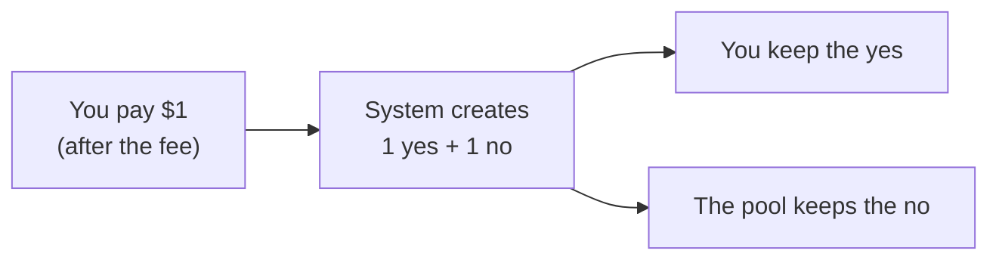
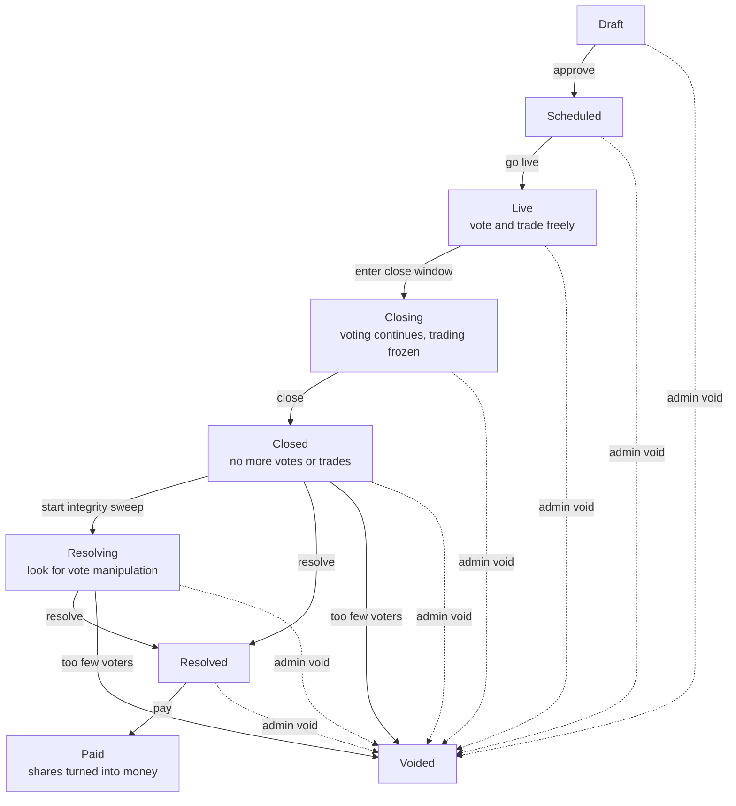

# How the market works

This page explains the money mechanics with no jargon and no code. If you understand
this page, you understand the product.

## Shares are just claims on the final percentage

Every market has exactly two kinds of share: **yes** and **no**.

When the market closes we count the votes. Say 63% voted yes. Then, forever after:

- one **yes** share is worth exactly **63 cents**
- one **no** share is worth exactly **37 cents**

The two always add up to a dollar. That is the whole trick, and it is why the system can
never pay out more than it took in: every yes share was created alongside a no share, and
together they are worth exactly one dollar.

## Where shares come from

You cannot buy a yes share from thin air. The system **mints them in pairs** — the code
calls a pair a *complete set*.

That pairing is the reason the money always balances. A dollar in becomes exactly one
dollar of future obligation — never more.

!!! note "Why this matters"
    A naive design would just let people buy "yes" and hope the books work out. This
    design makes it *arithmetically impossible* for them not to. At settlement the code
    literally refuses to pay out unless the yes shares and the no shares in existence
    both add up to the number of complete sets the market's pot can back.

## How the price is decided

There is no other person on the other side of your trade. You trade against a **pool** —
a pile of yes shares and a pile of no shares that the house seeded when the market opened.

The pool follows one rule: **multiply the two piles together, and that number must never
go down.**

If the pool holds 1,000 yes and 1,000 no, the product is 1,000,000. Buying yes shares
must leave the product at 1,000,000 or slightly above — and working out exactly how the
piles must move to keep that true is what tells you your price.

Here is the actual sequence for a buy, which is a bit more interesting than "one pile
shrinks":

1. Your money has the fee taken off it first.
2. What is left mints complete sets — so **both** piles grow by that amount.
3. The pool then keeps only as much of the side you are buying as the
   multiply-to-the-same-number rule demands, and hands you the rest.

Two consequences fall out of that rule:

- **Prices move with demand.** Buying yes makes yes more expensive for the next person.
- **The pool can never be drained.** As a pile gets small its price climbs steeply, and
  a sale big enough to empty a pile is refused outright rather than allowed to run the
  pool to zero.

The current price of yes is simply *the size of the no pile divided by the total*. With
1,000 of each, yes costs 50 cents. If the pool holds 770 yes and 230 no, yes costs 23
cents — plenty of yes shares available, so they are cheap.

!!! tip "This is called an automated market maker"
    You may see the initials **CPMM** in the code — "constant product market maker."
    That is just a formal name for the multiply-and-keep-it-at-least-equal rule above.
    Where the arithmetic does not divide evenly, the leftover fraction is always kept by
    the pool rather than handed to the trader, so the rule can only ever be satisfied
    with room to spare. [Prices and fees](../money/fees-and-pricing.md) works a real
    trade through the arithmetic.

## Who is on the other side, really

It is worth being blunt about this, because the pool can sound like a machine that takes
no risk.

The house seeds every market's pool with its own money — the built-in defaults in
`crates/application/src/model.rs` are $100 of complete sets for a daily market and $10 for
a flash market, and both are configurable. When the market settles, the
pool's leftover inventory is redeemed like anybody else's, and the difference between
what the pool got back and what the house seeded is the house's profit or loss on that
market. The code records it explicitly as the market's LP result.

So the house **is** the counterparty, and it can lose. That is why there is an automatic
brake: if the house's realised losses from seeding pools exceed a configured amount
inside a configured window, new markets stop being seeded. Already-live markets are
deliberately left alone.

The house's *reliable* income is the trading fee, not the pool.

## Voting, and why it comes first

You must vote before you may trade in a market. Two reasons:

1. **The vote is the answer.** Without votes there is nothing to settle against.
2. **Honesty.** If you could trade first, you would be tempted to vote for whatever makes
   your position pay, rather than what you believe. Voting first keeps the answer clean.

Your vote has two parts: which side you personally believe, and a guess at what
percentage of everyone else will say yes. The guess costs nothing and does not affect the
result — it is what you are *scored* on afterwards. See
[Scoring and reputation](scoring-and-reputation.md).

Late in a market's life the running tally is **hidden**, and trading is frozen during
that window — both buying and selling. Voting continues. Otherwise the last voters could
see exactly where the number sits and both vote and trade with near-certainty, which is
not a market, it is a free lunch.

How long that window lasts is configuration, not a constant. The built-in defaults are one
hour before close for a daily market and five minutes for a flash market. Whatever value
a market is created with is stamped onto that market and can never be moved afterwards —
an operator cannot extend or shorten the blackout on a market that is already running.
The control plane classifies that setting as *live-immutable* for exactly this reason;
see [The control plane](../build/control-plane.md).

## The full life of a market

A market is a **state machine**: it has a list of named states, and only specific moves
between them are legal. There are nine states and exactly seventeen legal moves; the code
in `crates/domain/src/market.rs` rejects every other combination by construction.

`Paid` and `Voided` are terminal: nothing moves out of them, not even an admin void.

The hidden-tally window is the `Closing` state. Note that the market can also be *held*
in `Resolving` while a human looks at it — that is not a separate state, it is a flag on
the market plus a timestamp saying when the automatic sweep is due.

## The two endings

**Paid** is the normal ending. Votes are counted, the percentage is fixed, and every
share — including the pool's own leftover inventory — is exchanged for its share of the
pot in a single transaction.

**Voided** is the safety ending, and it is worth being precise about what it does,
because the intuitive description is wrong.

A void is not a refund. It is a **neutral settlement**: every market is settled at exactly
50%, so every yes share and every no share pays 50 cents. It runs through the identical
settlement code as a normal payout, with the identical conservation checks.

That matters for what it feels like. If you bought yes at 70 cents and the market voids,
you get 50 cents back per share, not 70. You lose money. If you bought at 30 cents, you
gain.

Why not simply refund what everyone paid? Because a historical-replay refund would have
to claw money back from people who have already traded out or withdrawn, and it cannot
promise that nobody's balance goes negative in the process. Neutral settlement is the only
ending that is guaranteed payable from what the market actually holds.

A market voids automatically only when **both** conditions hold: fewer than the required
number of voters, **and** the amount of money at stake is below a configured floor. If a
thinly-voted market has real money in it, the software refuses to decide by itself and
hands it to a human curator, who then either settles it at the tally or voids it — with
that decision recorded as an audit fact.

That two-condition rule exists because a one-condition rule is gameable. If "too few
voters means void" were the whole rule, anyone holding a losing position could suppress
voting near the deadline and buy themselves a way out.

## What the house earns

A fee on each trade. The published rate is 1%, and it is charged on the way in for a buy
and out of the proceeds for a sell. Traders with a high reputation tier pay less, down to
a published floor — the details are on [Prices and fees](../money/fees-and-pricing.md).

The fee is a line item in the ledger like everything else, sitting in a fee account anyone
auditing the books can see. There is no separate settlement rake: at settlement the only
thing that reaches the fee account is the sub-cent remainder left over from dividing the
pot, which is assigned explicitly rather than quietly dropped.

## Where to go next

- [Scoring and reputation](scoring-and-reputation.md) — how a good crowd-reader is rewarded.
- [A day in the life](a-day-in-the-life.md) — the same story from a user's point of view.
- [Prices and fees](../money/fees-and-pricing.md) — the arithmetic, worked through.
- [Placing a trade](../walkthroughs/trade.md) — what the software does when you tap "buy."
