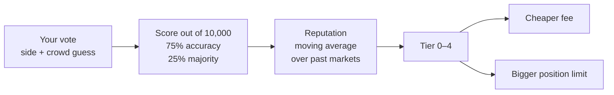

# Scoring and reputation

Voting is free, and it never pays cash. But it is not unrewarded: every vote is scored,
and your scores build a **reputation** that changes what the product costs you and how
much of it you are allowed to use.

This page explains the whole scheme. It is short, because the scheme is deliberately
simple and entirely published — the formula below is the one in
`crates/domain/src/scoring.rs`, and you can check any score by hand.

## Your vote has two parts

When you vote you say two things:

1. **Which side you believe** — yes or no.
2. **Your guess at the crowd** — what percentage of everyone else will say yes, from 0
   to 100.

The second part is what makes this a skill. Believing something and predicting that most
people agree with you are different claims, and the scoring rewards the second one much
more heavily than the first.

## The formula

A vote's score is out of 10,000, which is a convenient way of saying "to two decimal
places of a percent". Two components:

**Accuracy — 75% of the score.** How close your crowd guess was to the real answer.

> accuracy = 10,000 − (4 × how far off you were, in hundredths of a percent)

Because of the factor of four, being **25 percentage points wrong scores zero**. There is
no partial credit beyond that; it bottoms out rather than going negative.

**Majority — 25% of the score.** Did the side you personally picked end up above 50%?
This is all-or-nothing: 10,000 if yes, 0 if no. An exact 50.00% tie awards it to *both*
sides.

Combined:

> score = (3 × accuracy + majority) ÷ 4

which is the same thing as 75% accuracy plus 25% majority, computed in a way that keeps
every intermediate number a whole number.

### Worked examples

| You voted | You guessed | Actual result | Accuracy | Majority | Score |
|---|---|---|---|---|---|
| Yes | 70% | 70.00% yes | 10,000 | 10,000 (yes won) | **10,000** |
| Yes | 50% | 62.50% yes | 5,000 | 10,000 | **6,250** |
| Yes | 75% | 50.00% yes | 0 | 10,000 (a tie pays both) | **2,500** |
| No | 50% | 62.50% yes | 5,000 | 0 (no lost) | **3,750** |

Read the second row carefully: guessing 50 when the answer was 62.5 is 12.5 points off,
and 12.5 × 4 = 50, so half your accuracy is gone. The kernel is unforgiving on purpose —
this is a game about reading a crowd precisely, not about being vaguely right.

Rows two and four are the same guess with opposite side picks, and they differ by exactly
the 2,500 the majority component is worth. That is the ratio the design intends: reading
the crowd is worth three times as much as picking the winner.

## From scores to reputation

Your reputation is a single number between 0 and 1 (stored as millionths, so 0.5 is
`500000`). After each market you voted in resolves, it is nudged toward that market's
score:

> new reputation = k × old reputation + (1 − k) × this market's score

That shape is called an **exponentially weighted moving average**: recent results matter
most, older ones fade smoothly rather than dropping off a cliff. The constant `k`
controls how fast they fade, and it is chosen from three options with a plain-English
meaning — a **half-life** of 10, 20, or 40 markets. A half-life of 20 means that after
twenty markets, an old result has half the influence it started with. The shipped default
is 20.

Two details that exist because the arithmetic is done in whole numbers:

- The three constants are precomputed and pinned in the code, so `k` can never round to
  exactly 1 and freeze somebody's reputation in place.
- 0 and 1 are exact fixed points: a perfect record stays at 1, a perfect miss stays at 0.

Two rules keep reputation from being farmable:

- **Voided markets score nothing.** A market that voided has no truth to be measured
  against, and neutral scoring would mint free majority points for everyone.
- **Tiny markets do not move reputation.** A market only affects reputation if it cleared
  its participation minimum *and* its pot was at least a configured size. The published
  floor is $50. Without it, a handful of self-dealt markets with almost no money in them
  would be the cheapest possible way to farm a tier.

## Tiers, and what they get you

Reputation maps to a **tier** from 0 to 4 by simple thresholds, with each threshold an
inclusive lower bound. The values seeded into the database are 0, 0.2, 0.4, 0.6 and 0.8 —
so reputation 0.6 is tier 3, and 0.599999 is tier 2.

Tier does two things: it discounts your trading fee, and it raises the most money you may
have committed to any one market at a time. The published policy — the values migration
`0008` seeds into the configuration table, and the ones the operator catalog documents —
is this:

| Tier | Fee discount | Maximum committed position in one market |
|---:|---:|---:|
| 0 | none | $25 |
| 1 | none | $50 |
| 2 | 10 bp (1% → 0.90%) | $100 |
| 3 | 20 bp (1% → 0.80%) | $250 |
| 4 | 30 bp (1% → 0.70%) | $500 |

"bp" is a **basis point**: one hundredth of one percent. An operator can adjust both
columns, but only within bounds — caps may never be set below the published floors, and
the discount vector may move at most 10 bp per entry per change. See
[The control plane](../build/control-plane.md).

!!! warning "What a bare local server actually enforces"
    The running process reads its tier policy from environment variables at startup, and
    its built-in defaults — in `crates/application/src/model.rs` — are *no discount* and
    *no position cap*. So the table above is the intended, published, database-seeded
    policy; a server started with no economy environment variables set will charge every
    tier the base fee and impose no cap. `POSITION_CAP_MICRO_BY_TIER`,
    `FEE_DISCOUNT_BP_BY_TIER` and `MIN_FEE_BPS` are the variables that install it.

There is also a floor under the discount: whatever the tier discount is, the effective
fee never drops below `min_fee_bps`, published at 10 bp. So a tier-4 trader on a market
with an unusually cheap base fee still pays at least 0.10%.

!!! note "The anti-flip rule"
    There is one exception to the tier discount. If you sell a side you bought within the
    last hour, that sell pays the **full base fee** with no discount at all. Without it,
    a high-tier trader could buy and sell repeatedly at a discount to run up fee volume
    cheaply, which matters because trading fees are how promotional credits convert to
    real money. The window is published at 3,600 seconds; setting it to zero switches the
    rule off, which is what the built-in default does.

## Voter rewards are points, not cash

Reputation is deliberately *not* money. Cash rewards for voting would create an obvious
economy — pay someone to vote a particular way, and the vote stops measuring belief. The
decision log states this outright: voter rewards are points and reputation only, which
keeps the vote layer outside the money system entirely and kills pay-per-vote sybil
economics before it starts.

What reputation buys you is a cheaper fee and a bigger position limit — advantages inside
the game, earned by being good at the game.

## Where to go next

- [Casting a vote](../walkthroughs/vote.md) — every defence a vote passes through.
- [Prices and fees](../money/fees-and-pricing.md) — how the tier discount reaches a price.
- [How the market works](how-the-market-works.md) — the mechanism the score measures.
