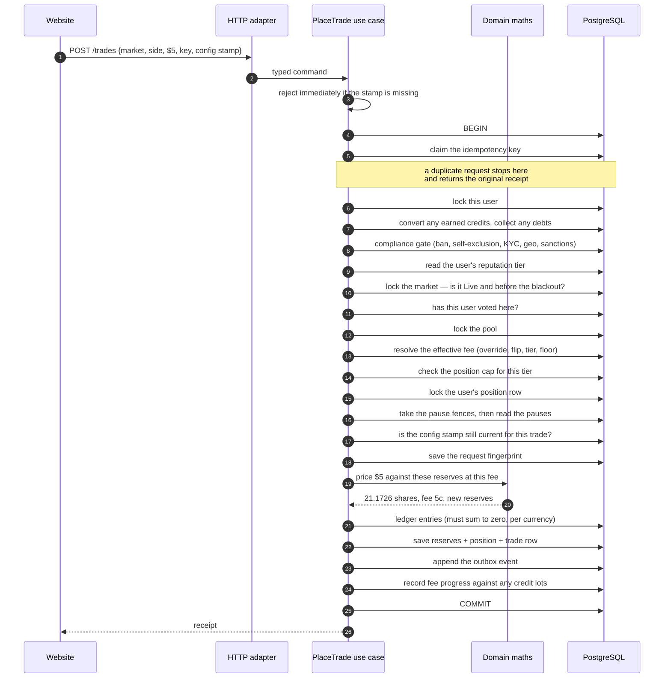
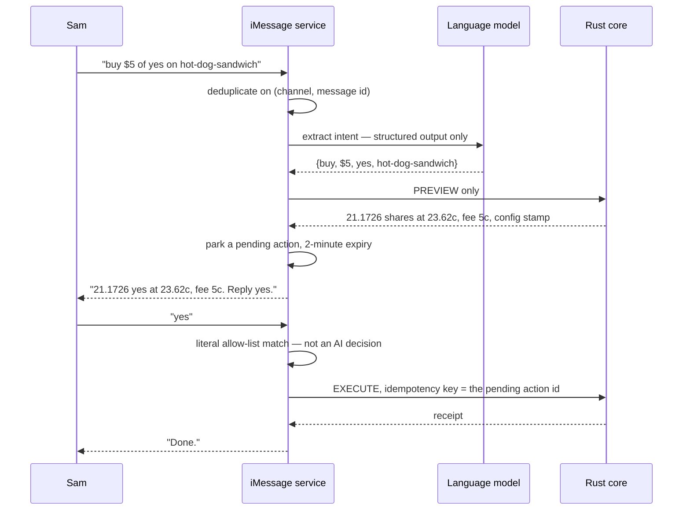

# Placing a trade

One tap on "Buy", followed all the way down. This is the single best way to see how the
layers work together.

## What the user does

Sam is looking at a market where yes currently costs 23 cents. Sam types $5, sees a preview
— *"21.1726 yes shares, average price 23.62 cents, fee 5 cents"* — and taps **Confirm**.

## The two-step design

Notice there were two interactions: a **preview** and then an **execute**. That is
deliberate.

The preview is a read-only calculation. It cannot change anything. It returns the numbers
*and a stamp*: the generation number of the configuration those numbers were computed under.

When Sam confirms, that stamp is sent back. The server checks whether anything that feeds
*Sam's* price has changed since — the fee, a market-specific fee override, Sam's tier
discount, the minimum fee floor, Sam's position cap, the anti-flip window. If any of them
moved, the trade is rejected as stale and Sam is shown a fresh price.

Two details make that check trustworthy rather than decorative:

- **It is specific.** An unrelated configuration change — the comment spam limit, a feature
  flag — does not invalidate Sam's quote. Only keys that feed the number Sam saw do.
- **It fails closed on missing history.** If the record of what changed has been pruned so
  far back that the server cannot tell what happened since Sam's stamp, the answer is
  "stale", not "probably fine".

**Sam can never be filled at a price Sam was not shown.** A trade that arrives with no stamp
at all is refused before the server so much as opens a database transaction — the check is
the very first line of the use case, deliberately placed so that a stamp-less request cannot
acquire a single lock.

## The journey

That order is written out in the first comment of `crates/application/src/place_trade.rs`,
so a reviewer can compare the code to its own stated contract at a glance.

## Why each step is where it is

**Claim the key first.** Before reading anything, the use case claims Sam's idempotency key.
If Sam's phone sent the request twice, the second one blocks here, then finds the first
already succeeded and returns that same receipt. One trade, not two.

Doing this *first* is not a style preference. PostgreSQL gives you no way to recover from a
duplicate-key error partway through a transaction — once it fires, the whole transaction is
poisoned. So the claim has to come before any work, not after it.

**And the fingerprint is checked before anything else on a replay.** A repeat is compared
against a canonical fingerprint of the original request — market, user, side, action, amount,
stamp. A match replays the original receipt with no further checks at all. A *mismatch* — the
same key reused for a different trade — is a typed conflict error. Without this, reusing a key
would hand back somebody else's receipt.

**Lock the user, then the market, then the pool.** Always this order, everywhere in the
codebase. Mixed lock orders are how programs deadlock, and this project has the scar to prove
it.

**Convert and collect while the user is locked.** Every path that locks a user takes the
opportunity to finish any pending lazy work: promotional credits whose fee progress is now
complete get converted, and any outstanding debts get collected. Doing it here means it
happens under a lock that is already held, rather than needing a lock of its own.

**Check the market state under its lock.** A market that has entered its blackout window
refuses trades even if its stored state has not caught up yet — the check is against the
clock *and* the state, read together under the lock. A row that is lagging must not accept a
trade it should have refused.

**Check the vote gate inside the transaction.** Not from a cached view. Sam must have voted
in this market, checked at this instant.

**Take the fences, then check the pauses.** The kill switches are read after every row lock
and immediately before the first write. A request that had been queued waiting on a lock
therefore observes the pause when it wakes up, rather than having checked before it started
waiting. A kill switch that can be raced is not a kill switch.

**Ask the domain.** The use case does not know how prices work. It hands the reserves, the
dollar amount and the effective fee to pure arithmetic and gets an answer back. That
arithmetic is separately tested against hundreds of cases, including randomly generated
extremes.

**Write everything together.** The ledger entries, the trade row, the updated pool, Sam's
position, the outbox event and the credit progress are all written inside one transaction.
Either they all become real at commit, or none of them do. There is no window where money
moved but the trade is missing.

## The ledger entries

For Sam's $5 buy at a 1% fee, exactly three entries:

| Account | Amount |
|---|---:|
| Sam | −$5.00 |
| Market escrow | +$4.95 |
| Fees | +$0.05 |

If the effective fee were zero, there would be **two** entries, not three with a zero — both
the domain and the database forbid a zero-amount entry.

## Selling works the same way

The identical sequence handles a sell, with three differences: the amount is a number of
shares rather than dollars, the use case checks that Sam actually holds them, and the fee
comes out of the proceeds instead of the input. Selling also records a **realisation** — a
permanent fact stating how much Sam made or lost on that sale, which is what leaderboards
and profiles are built from. They report real recorded outcomes, not a recomputed guess.

Selling is also where the anti-flip fee rule bites: if Sam bought this side within the last
hour, this sell pays the full base fee with no tier discount.

## What could go wrong, and what happens

| Situation | Result |
|---|---|
| No configuration stamp on the request | Refused before any transaction opens |
| Sam has not voted in this market | Refused — voting is a precondition |
| The market is in its blackout window | Refused as frozen |
| The market is not open at all | Refused as not open |
| Trading is paused, globally or here | Refused with a specific paused error |
| Voting is paused on this market | Refused — the book never trades against a frozen tally |
| Sam is banned, self-excluded, or fails a screening | Refused by the compliance gate |
| Sam is over the position cap for their tier | Refused with the published cap message |
| The configuration moved since the preview | Rejected as stale; Sam re-previews |
| The same key with different parameters | Typed conflict — never somebody else's receipt |
| Sam's phone sent it twice | One trade; the second returns the same receipt |
| Sam tries to sell shares he does not have | Refused |
| The trade would drain a pool side | The arithmetic refuses |
| The amount is too small to buy one micro-share | Refused rather than taking the money |
| The server crashes mid-write | Nothing committed. The trade never happened. |

## The same trade over iMessage

If Sam texts *"buy $5 of yes on hot-dog-sandwich"* instead:

The language model can only ever produce a *proposal*. Execution requires a plain-text
confirmation matched against a short literal allow-list; anything else cancels the pending
action outright.

And if the configuration moved while Sam was deciding, the "yes" does **not** execute the
old plan. The service expires the pending action, takes a fresh preview at the new
generation, and asks for a new "yes". The same rule as the website, enforced in a different
language.

Every step is recorded — the original message, the model's interpretation and its required
one-line reason, the preview shown, the confirmation received, and the resulting ledger
transaction — so "why did this money move?" has a complete answer.

## Where to go next

- [Prices and fees](../money/fees-and-pricing.md) — the arithmetic behind 21.1726.
- [Casting a vote](vote.md) — the precondition.
- [Getting paid](payout.md) — where those shares end up.
