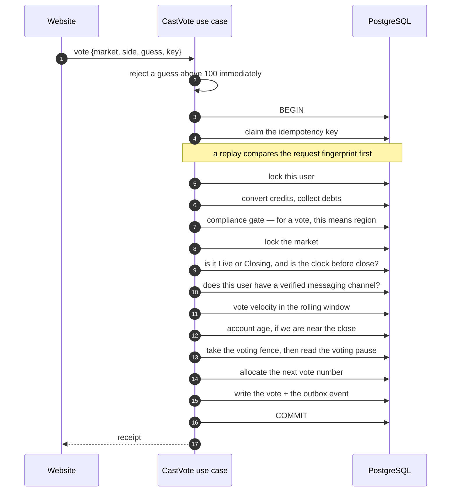
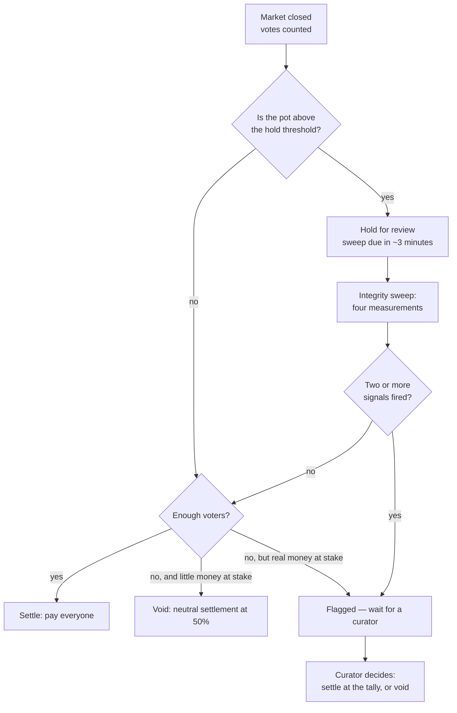

# Casting a vote

Voting looks trivial — a single button — but it is the most attacked surface in the whole
product, because the votes *are* the answer. Whoever controls the votes controls every
payout.

## What the user does

Sam opens a market, reads the question, and taps **No**. Sam is also asked to guess what
percentage of everyone else will say yes; Sam says 35. That guess costs nothing, changes
nothing about the result, and is what Sam is scored on later.

Sam's vote cannot be changed afterwards. One vote per person per market, enforced by a
uniqueness rule in the database rather than by the application remembering.

## What the software does

## The integrity bar, honestly labelled

There are two different things going on, and conflating them would be misleading. Some
checks happen **at vote time and can refuse your vote**. Others are metadata **recorded now
and analysed after the market closes**.

### Checked at vote time — these refuse

| Check | The attack it stops |
|---|---|
| A verified messaging channel is required | Making a thousand accounts to swing the answer. Without a linked, verified channel you cannot vote at all. |
| One vote per user per market | Voting repeatedly |
| Region must be clear | Voting from a jurisdiction the product may not operate in |
| Not banned, not self-excluded | Excluded users participating |
| Vote velocity — at most 30 votes in a rolling hour, across all markets | Scripted mass voting |
| Minimum account age — 72 hours — but only inside the last 10 minutes before close | Creating fresh accounts at the last moment to tip a market that is about to settle |
| The market is Live or Closing, and the clock is before the close | A lagging state row accepting a post-deadline vote |
| The voting pause on this market | An operator emergency stop |

Two of those are worth a second look.

**The account-age rule only applies near the close.** A new account can vote freely in a
market with days left; it cannot appear in the final window. That is deliberately targeted:
the manipulation being prevented is *late* creation of an artificial crowd, and a blanket age
requirement would just be a worse onboarding experience for honest new users.

**The clock is checked as well as the state.** A market whose stored state has not yet caught
up to its own closing time must not accept a vote. The check is `Live or Closing` **and**
`now < closes_at`, read together under the market's lock.

### Recorded now, analysed later — these do not refuse

The IP address the vote came from and a device fingerprint are **written down** with the
vote. Neither is checked at vote time. Neither can refuse you.

They feed the post-close **integrity sweep**, which is where clustering is actually detected.
That is the right place for it: you cannot tell that a crowd is artificial by looking at one
member of it. You need the whole set.

The IP is only recorded when it can be trusted — a forwarded-for header is honoured only when
the direct connection came from a configured proxy range. An untrusted claim is discarded
rather than recorded as if it were fact.

## Vote numbers, and when they are visible

Each vote gets a sequential number, allocated while holding the market's lock so two votes
can never receive the same position.

But you are only *told* your number while the tally is public. During the hidden-tally window
the receipt withholds it, and it becomes visible again once the market has resolved.

The reason is that a vote count is itself information about the answer. "You are voter
#1,043" during a blackout tells you how fast the crowd is arriving, which is exactly the kind
of signal the blackout exists to remove.

## The hidden window

For a period before closing, the running tally is concealed and trading is frozen — both
buying and selling. Voting continues.

Without this, the final voters could see exactly where the number sits, vote to nudge it, and
trade on the near-certain outcome. The hidden window turns the endgame back into a judgement
call.

## After the market closes

The votes are counted, and if the pot is large enough to be worth attacking, an integrity
sweep runs before anybody is paid.

### The four measurements

The sweep is not a vague "looks suspicious" judgement. It computes four ratios and compares
each to a threshold:

| Signal | What it measures | Strength |
|---|---|---|
| **Vote burst** | Votes in the final window versus the average of prior windows | Medium |
| **Young accounts** | Share of voters created recently | Medium |
| **Subnet concentration** | Share of votes from the largest single network neighbourhood | Weak |
| **Device concentration** | Share from the largest single device fingerprint | Weak |

Four design choices in that table are worth naming:

- **Two signals are required to flag.** One alone is a pass, with the number recorded. A
  single ratio crossing a line is a coincidence you will see constantly at scale.
- **The two weak signals are labelled weak in the code**, with a note explaining exactly what
  they are: an IP-prefix proxy and a client-asserted device identifier. Neither is proof of
  anything; both are cheap to spoof. Writing that down beside the check is more honest than
  presenting all four as equals.
- **Thin data skips a check rather than guessing.** If fewer than a minimum number of votes
  were cast, every ratio check is skipped with a recorded reason. If metadata coverage is
  below a minimum share, the two weak checks are skipped too. A ratio computed from four data
  points is noise, and treating it as evidence would produce exactly the false flags that
  train operators to click "approve".
- **A zero baseline is handled explicitly.** If there were no prior windows to compare
  against, the burst check compares the final window's raw count to the minimum instead of
  dividing by zero.

Every measurement — the value, the threshold, the coverage, and whether it fired — is stored
on the market, so a flag can be argued about afterwards with numbers rather than adjectives.

### The two protections that matter

**Minimum participation.** A market with too few voters is not settled at its tally. A
three-person "crowd" is not a crowd.

**Void is a real outcome, and a real cost.** If something looks wrong, the market settles
neutrally at 50%. Nobody gets a refund of what they paid — a buyer at 70 cents loses, a buyer
at 30 cents gains — but nobody is paid out on a result the operator does not believe.

And the automatic void requires **two** conditions: too few voters *and* little money at
stake. A thinly-voted market with real money in it goes to a human, because "too few votes
means void" as a standalone rule is itself an attack: suppress voting near the deadline and
you have bought yourself an exit from a losing position.

## Why voting is free

If votes cost money, the answer would be dominated by whoever had the most money, and the
thing being measured — what people believe — would be destroyed.

The project goes further and refuses to pay cash for voting either, for the mirror-image
reason: paid votes are purchasable votes. Voter rewards are reputation and tier benefits
only, which keeps the vote layer entirely outside the money system. The vote is the
measurement; the trading is the game played on top of it. Keeping them separate is what makes
the measurement worth anything.

## Where to go next

- [Scoring and reputation](../start-here/scoring-and-reputation.md) — what your guess earns you.
- [Getting paid](payout.md) — what happens to the tally.
- [Placing a trade](trade.md)
