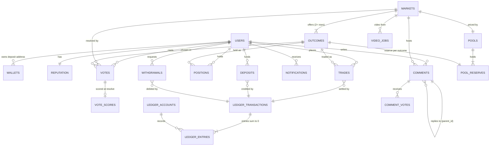
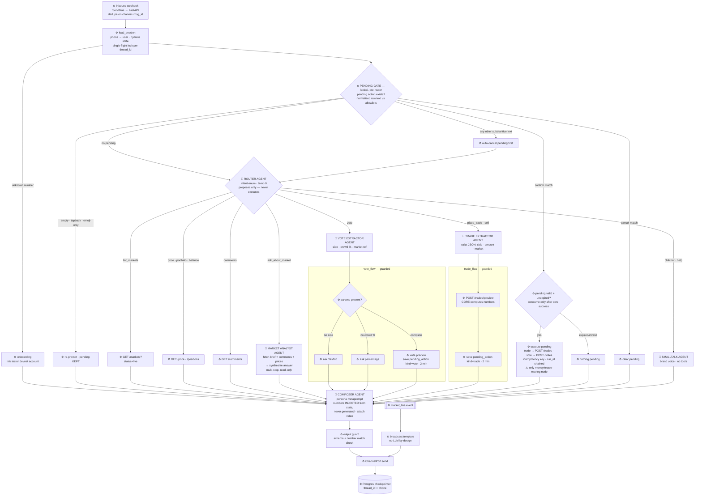

# Opinions — Full Product & Architecture Plan

**Goal:** launch-complete, not minimal. Every user-visible surface designed for excellence across five dimensions: market cadence/speed, voter economy, trust & polish, video production at scale, and mobile experience. Two things cannot be built in code — liquidity and community — so bootstrap and compliance run as first-class workstreams alongside engineering.

**Chain:** Solana (USDC rail only; all game logic off-chain in a custodial ledger).
**Backend:** Rust monolith (Axum + Tokio + SQLx + Postgres + Redis), state-primary core with a transactional outbox event log (5.1).
**Frontend:** React/Next.js, WebSocket-first.
**Distribution:** iMessage-first conversational layer (Section 7.5) alongside web.
**Engineering bar (non-negotiable):** clean architecture with an enforced dependency rule, SOLID applied Rust-idiomatically, named patterns with a purpose, and coverage gates including 100% on the money core — see 5.5.

> Companion docs: [decisions.md](decisions.md) (locked decision log) · [research-notes.md](research-notes.md) (external verification, 2026-08-12) · [../PLAN.md](../PLAN.md) (execution plan).

---

## 1. Product specification (from the e2e walkthrough)

| Surface | Specification |
|---|---|
| Market mechanism | Vote-share scalar: YES/NO shares trade in cents, sum to $1, redeem at final vote distribution with cleaner fee disclosure and published math |
| Cadence | Daily curated markets **plus hourly flash markets**; instant resolution |
| Vote flow | Two-step modal: side + "what % will agree" slider, "I Voted" sticker, sequential vote number with visible scoring after resolution |
| Vote→trade gate | Trading locked until you vote, plus rep-based bet limits |
| Trading UI | Buy/Sell with cents pricing, quick-add chips, Max Payout + Avg Price preview, explicit fee line, portfolio view across markets, fast confirmation (<300ms perceived) |
| Voter rewards | Explicit, published scoring formula; rep tiers; leaderboards; rep-gated limits and fee discounts |
| Social | Threaded comments with @mentions, up/down votes, images, X-linked profiles, Top Holders by side, fully public Activity tape with moderation tooling and profile stats |
| Notifications | Bell + panel with personalized resolution notices (your PnL and vote outcome), deep links, real-time toasts, push (web + APNs), digest email, granular prefs |
| Video | GenAI pipeline producing video reels per market automatically — this enables hourly cadence affordably |
| Growth | Refer Friend, PnL share cards, double-sided referral credits and creator partnerships |
| Platform | Web + installable PWA at launch; native iOS fast-follow (money stays on web if App Store blocks wagering) |

**Market position (2026-08-12):** The opinion market category is validating with multiple entrants. Our focus is on speed, transparency, mobile-first design, and community strength.

---

## 2. Market mechanism specification

### 2.1 Instrument

Each market has two outcome tokens, YES and NO. One dollar of collateral mints one complete set (1 YES + 1 NO). At resolution, if the final vote fraction for YES is `v ∈ [0,1]`:

- each YES share redeems at `v` dollars
- each NO share redeems at `1 − v` dollars

Every minted pair redeems to exactly $1 total, so the system is **fully collateralized by construction**. There is no house exposure from trading and no unbounded LMSR loss; the only house risk is the liquidity seed (2.3).

Markets resolve on the final vote, not the trading price. Multi-option markets generalize: one token per option, redemption = that option's vote share, shares sum to $1.

### 2.2 Pricing — constant-product AMM over complete sets (FPMM)

Pool holds reserves `y` (YES tokens) and `n` (NO tokens). Invariant `k = y·n`.

Marginal prices (always sum to 1):

```
p_yes = n / (y + n)
p_no  = y / (y + n)
```

**Buy YES with collateral `c`** (fee `f` skimmed first, `c' = c·(1−f)`):
`c'` mints `c'` YES + `c'` NO; the NO goes to the pool; YES returned to the user restores the invariant:

```
yes_out = y + c' − (y·n) / (n + c')
avg_price = c / yes_out
```

**Sell `s` YES for collateral `c`:** solve `(y + s − c)·(n − c) = y·n` for `c` (quadratic, take the root in range), then apply fee. Buying NO / selling NO are symmetric with reserves swapped.

Properties: large orders move price (slippage is honest and visible — show avg price and max payout in the order preview exactly as they do), price impact decreases with pool depth, and prices always remain a coherent probability pair.

### 2.3 Liquidity seeding

The house seeds each market's pool at creation with `S` complete sets at prior `p₀` (choose reserves `y₀, n₀` with `n₀/(y₀+n₀) = p₀`; start at 0.5 absent a prior). The house LP position redeems at pool value at resolution — exposure is bounded by `S` per market. Start: $500–$2,000 per daily market, $100–$300 per hourly flash market; adjust from realized LP PnL.

**LP risk is adverse selection, not variance** (R1 review): traders who are better informed about — or able to influence — final `v` systematically drain the seed. Before real money: model expected LP loss as a function of informed-trader share and manipulation rate; per-tier seed sizes live in dynamic config; and an **automatic LP kill-switch** (pause seeding, optionally pause the market) triggers on realized LP PnL breaching a configured threshold. This is a launch control, not a post-hoc knob.

### 2.4 Fees

Single, visible trade fee of 1% (matching their observed ~1% effective cost) into a fee account. No settlement rake at launch — "you keep what the vote says" is a marketing line and a superiority point. Withdrawals at network cost.

### 2.5 Ledger math

All money in integer micro-USDC (`i64`, with checked `u128`/`i128` intermediates under proven input bounds), all shares in micro-shares. No floats anywhere in the ledger or AMM path. **Rounding always favors the pool, never the user:** each rounding operation (fee ceil, retained-reserve ceil, payout floor) errs by strictly less than 1 micro-unit in the pool's favor, and a single trade touches up to two such operations (≤2 micro total per fill — the per-operation bound is <1, the direction is uniform, and property tests assert both). Property-test the AMM: invariant preserved, round-trip buy/sell never profitable at zero price movement, conservation of collateral across mint/burn/redeem.

---

## 3. Voting and the voter economy

### 3.1 Vote object

`{ market_id, user_id, side, crowd_guess ∈ [0,100], sequence_no, created_at }` — one per user per market, immutable once cast, sequential vote number surfaced in the UI (their "#000096" detail is good; keep it).

### 3.2 Scoring (published and transparent)

At resolution with actual YES fraction `a` (percent):

```
accuracy  = max(0, 1 − |crowd_guess − a| / 25)     // linear kernel, 0 beyond 25pts off
majority  = 1 if side matches the winning side else 0
score     = 75·accuracy + 25·majority               // 0–100 per market
```

Weighting accuracy 3:1 over majority-matching is deliberate: it rewards understanding the crowd rather than herding. It is **not** the defense against bag-coupled voting — that defense is the eligibility and integrity stack in §3.4 (R2: the earlier "defuses the coupling" claim was wrong and is retracted). Publish the formula on a "How scoring works" page — their vagueness is our opening — including the tie definition: at exactly 50.00%, *both* sides count as winners for the majority component.

### 3.3 Reputation

`rep = EWMA of per-market scores (half-life ~20 markets)`, displayed on profiles with tier badges. Rep gates real things:

- max open position size per market (new accounts start low)
- fee discounts at higher tiers
- eligibility for voter leaderboards and any future voter reward pool

Voter rewards at launch are **points/rep only** — no cash for voting. This keeps the vote layer outside the money system, kills the pay-per-vote sybil incentive, and stays legally simpler. A rake-funded voter pool can come later if growth needs it.

### 3.4 Integrity (existential for vote-resolved markets)

The vote is the oracle: whoever controls votes controls redemption. A written **vote-oracle threat model** is a launch-blocking artifact, and the *minimum integrity bar below ships with the core loop (Phase 1–2), not after it* — real-money resolution without it is insolvency-by-design (R1 review).

- **Minimum bar (launch-blocking):** unique verified phone per voting account, device fingerprinting, per-market vote velocity limits, elevated friction for accounts younger than 72h near close.
- **Minimum participation threshold, with anti-void rules (R2):** markets closing with fewer than `min_votes_to_resolve` votes (config, per market tier, must be positive before go-live) **void to neutral redemption** (both sides redeem at 50¢ from escrow, §4.2) instead of resolving — a thin electorate is trivially buyable. But the void rule must not itself become the trade: a losing holder could suppress participation to force a refund, and winners could pad votes to force resolution. Therefore: automatic void applies only when *both* participation < threshold *and* open interest is under a configured floor; above the OI floor, a thin market extends its voting window once (config) and then goes to curator decision (resolve/void), never auto-void; and vote-suppression/padding patterns near the threshold are first-class signals for the anomaly sweep. All three knobs live in dynamic config.
- Hidden tallies and hidden vote counts in the final minutes of every market (default 10 for dailies, 2 for flash — config per tier). **While tallies are hidden, ALL new trades freeze — both sides (R2, supersedes the R1 buys-only rule).** Hiding the oracle while any side of the book stays open hands a last-look to whoever can estimate or steer the hidden votes — buy-side accumulation *or* informed dumping into the house LP. A short full quiet period before close is the clean mechanism: positions simply wait out the window into sub-second resolution. (The "price keeps trading" marketing line dies here; "fair close auction" replaces it.)
- Sybil stack (full): IP/ASN clustering, per-market anomaly job that flags vote bursts before payout finalization.
- Resolution hold: instant for pots under a threshold; a 2–5 minute automated integrity sweep above it. Publish the rule so the delay reads as fairness, not slowness.
- **Bag-and-ballot coupling, stated honestly:** the vote→trade gate means every vote *precedes* any position (votes are immutable and cast before trading unlocks), so a single account's bag can only follow its ballot, and one vote is worth 1/N of the outcome. The economically meaningful attack is therefore sybil-shaped — many accounts, small votes — which is exactly what the minimum bar + participation threshold + anomaly sweep defend. The 75/25 scoring split rewards honest crowd-guessing but is *not* the bag-defense; the eligibility stack is. Publish this reasoning on the "How scoring works" page.

---

## 4. Market lifecycle and speed

### 4.1 Creation pipeline (curated, fast)

`trend ingestion → LLM drafts (question, options, description, video script) → curator dashboard one-click approve/edit → scheduled`. Creating a market is a row insert plus a pool seed — milliseconds. Video generation is an async job kicked at approval; daily markets batch-generate overnight, flash markets can go live with a branded template card and hot-swap the video when the render lands (target < 5 minutes).

### 4.2 State machine

`draft → scheduled → live → closing (tallies hidden, all trading frozen) → closed → resolving (integrity sweep if triggered) → resolved → paid`, plus the **`voided` terminal** reachable from `closed`/`resolving` automatically (D21 anti-void rules) and from any pre-paid state by admin. **Void settlement is current-state neutral redemption from escrow** — every outstanding share redeems at 50¢ (`r_yes = r_no`), through the same conservation-checked settlement path as normal resolution — because replaying ledger history in reverse can debit users who already withdrew (R3); the §10.2 manual unwind stays an admin fraud tool whose clawbacks may queue as receivables. Every transition is an event on the log with a server-authoritative timestamp; bets/votes sequenced after their cutoff are rejected deterministically.

### 4.3 Resolution (the speed showcase)

Running tallies live in Redis and in the resolver's memory; at `closed` the outcome already exists. Resolution computes `v`, marks redemption values, and executes payouts as one batched, idempotent double-entry transaction (ledger transaction IDs make a crashed job safely re-runnable). Target: **position balances updated and notifications delivered within 1 second of market close** for normal markets. This, plus hourly flash markets, is the headline speed difference users can feel.

---

## 5. System architecture

### 5.1 Shape

Rust monolith, modular internally, one deployable. Modules: `ledger`, `amm`, `markets`, `votes`, `scoring`, `resolution`, `social` (comments/holders/activity), `notifications`, `payments` (deposit watcher + withdrawals), `video` (job orchestration), `admin`. NATS (or an in-process bus initially) carries domain events; Postgres is the source of truth; Redis serves tallies, hot feeds, unread counts, and WebSocket presence. A thin WS gateway fans out price ticks, trades, votes-count changes, comments, and notifications.

**State-primary core with a transactional outbox** (terminology fixed in R1 review — this is not an event-sourced write model): Postgres state is the source of truth; every state change (trade, vote, transition, payout, comment, notification) *also* appends a domain event in the same transaction, relayed via the outbox. Read models (charts, feeds, leaderboards) are projections of that event log and are rebuildable from it; the write model is never reconstructed from events. This buys replayable read models, a complete audit trail, and cheap new features — without event-store complexity on the money path.

### 5.2 Data model (primary tables)

`users`, `auth_identities` (email/social/X link), `ledger_accounts`, `ledger_entries` (**double-entry**: every movement is balanced debit/credit rows; user balances are derived, never stored as a mutable single number), `markets`, `pools`, `positions`, `trades`, `votes`, `vote_scores`, `reputation`, `comments`, `comment_votes` (unique `(user_id, comment_id)`), `notifications` (denormalized payload JSONB, `read_at`), `deposits`, `withdrawals`, `video_jobs`, `referrals`, `audit_events`. Full ER model with column-level detail: 5.6.

### 5.3 Payments (Solana USDC)

Embedded wallets (Privy or Turnkey) created at signup double as deposit addresses; a Solana indexer/webhook credits the ledger on confirmed USDC transfers. Card deposits via onramp (Coinbase Onramp and one backup, e.g. MoonPay — both support Solana USDC; get written use-case approval from both before integrating). Withdrawals: queued, risk-checked, batched from a hot wallet with per-day limits and a cold treasury. Testnet path for day one: Solana devnet USDC via Circle faucet + onramp sandbox cards, full loop.

### 5.4 Performance posture

The AMM is arithmetic, not matching — per-market throughput is a non-issue at any realistic scale. The engineering effort goes to correctness (double-entry invariants, idempotency, deterministic cutoffs) and perceived latency: optimistic UI on order preview, sub-300ms trade confirmation, WS tick fanout under 100ms. Shard-by-market is the scale-out story if ever needed; do not build it now.

### 5.5 Non-negotiable engineering standards

These are conditions of merge, enforced by CI and review — not aspirations. Deviations require a written ADR (architecture decision record) approved by the tech lead; "non-negotiable" without an amendment process just gets ignored under deadline pressure, so this is the one legitimate door.

**Clean architecture (hexagonal / ports-and-adapters).** The workspace is split into crates by layer, and dependencies point inward only:

- `domain` — the money core: ledger math, AMM formulas, vote scoring, market state machine. Pure functions and types. Zero I/O, zero framework dependencies (no tokio, sqlx, axum, HTTP types). Deterministic by construction.
- `application` — use cases (PlaceTrade, CastVote, ResolveMarket, RequestWithdrawal) that orchestrate the domain through **ports**: traits it defines (`LedgerStore`, `TallyReader`, `Clock`, `EventPublisher`).
- `adapters` — implementations of those ports: Axum handlers, SQLx repositories, the Solana indexer, onramp clients, video providers, NATS publisher, Redis caches.
- `main` — wiring only: construct adapters, inject them, start the runtime.

The dependency rule is enforced mechanically (workspace crate boundaries plus a CI check on the dependency graph), not by convention. The payoff is the whole plan in miniature: the money core runs without a database, which is exactly what makes exhaustive testing of it cheap and property testing possible.

**SOLID, translated to Rust honestly.** Single responsibility: one use case per module, one reason to change per type. Open/closed: extension through traits and exhaustive enums — a new market type is a new variant, and the compiler locates every site that must handle it. Liskov: trait contracts are documented invariants, and a shared contract-test suite runs against every implementation of a port (every `LedgerStore` impl passes the same tests). Interface segregation: small role-specific traits (`TallyReader`), never god-service traits. Dependency inversion: domain and application depend only on traits; concrete types meet each other in `main` and nowhere else.

**Patterns in service of this system** (each named because it solves a problem we actually have): the **transactional outbox** (domain events committed in the same transaction as state, relayed to NATS — no dual-write bugs; the retained rows are the append-only event log per 5.1); CQRS-lite (writes through aggregates, reads through projections); **typestate/exhaustive-enum state machine** for the market lifecycle so illegal transitions don't compile; repository ports with the ledger transaction as the unit of work; **saga/process manager** with idempotency keys for every multi-step money flow (deposit credit, payout, withdrawal); strategy objects for pricing curves and swarm personas; **newtypes for every quantity** (`MicroUsd(i64)`, `MicroShares(i64)`, `BasisPoints(u16)`) so raw integers never cross an API boundary and unit confusion is a compile error.

**Code quality gates (blocking in CI):** rustfmt; clippy with a curated pedantic set at `-D warnings`; `unsafe` forbidden outside audited, ADR'd exceptions; `unwrap`/`expect`/panics denied on request paths; typed errors (`thiserror`) end to end; `cargo audit` + `cargo deny` for supply chain; mandatory PR review; ADRs for architectural changes.

**Testing & coverage policy.** The pyramid is already specified (property tests on the core, contract tests on ports, integration tests on adapters, the Section 9 swarm on the whole). Coverage is measured with `cargo-llvm-cov`, line **and** branch, and gated as follows:

- **Money core (`domain` + ledger/AMM/resolution/scoring): 100% line coverage enforced in CI on stable** (`--fail-under-lines 100`). Branch coverage is measured on a scheduled nightly-toolchain job and reviewed (it becomes blocking when cargo-llvm-cov stabilizes branch gates — the stable toolchain cannot gate on branches today; R1 review). Purity makes 100% genuinely reachable, and this is the code where an untested branch is a solvency bug.
- Because line coverage is gameable, the core additionally carries **mutation testing (`cargo-mutants`) with a ≥90% kill rate**, computed as killed/(killed+missed) from the mutants JSON by a checked-in gate script — the metric that proves tests would actually notice a bug, not merely execute the line.
- Application and adapters: **≥90% floor**, ratcheted — a PR may never lower coverage. Exclusions (generated code, `main` wiring) live in one audited allowlist file with a justification per entry.
- A test must assert behavior; tests that execute code without meaningful assertions fail review, and swarm traffic never counts toward coverage.

### 5.6 Data model & comms decisions

The full ER model lives in [er-diagram.mermaid](er-diagram.mermaid); the decisions it encodes:

- **Outcomes are first-class rows**, not columns on markets. A binary market is 2 outcome rows; multi-option markets are N rows with no schema change. `final_vote_bps` and `redemption_micro` are written at resolve, making redemption values auditable data, not recomputation.
- **Double-entry all the way down.** `ledger_transactions` group `ledger_entries` that must sum to zero; entries are append-only signed micro-USDC; balances are always derived. Every trade, deposit, payout, withdrawal, seed, reversal, credit grant, and credit conversion is a `ledger_transactions.kind`. `idempotency_key` is unique — replaying a crashed job is safe by construction. Sum-to-zero is enforced in the domain layer for Phase 0 and by a **deferred constraint trigger that must land before any external write adapter is accepted** (Phase 1 blocking; a row-level CHECK cannot express a cross-row sum — R1 review).
- **Account classes (R1 review).** Internal custodial accounts (`user`, `pool`, `fees`, `house`, `escrow`) can never go negative. One `external` contra account represents the outside world: deposits are `external → user` transfers, withdrawals the reverse, and house/genesis funding is an explicit `external → house` transaction — so the external account's (negative) balance always equals total net inflows, every transaction still sums to zero, and "deposits are unrepresentable under universal non-negativity" is resolved without weakening the internal invariant.
- **Two currencies from day one:** `usdc` (withdrawable cash) and `usdc_credit` (non-withdrawable bonus credits, §11) as separate accounts per user. Credits convert to cash only via explicit `credit_convert` transactions after wager-through. Modeling this now costs a column; retrofitting it after a counsel decision for the sweepstakes structure would be a ledger rewrite.
- **`pool_reserves` is one row per (pool, outcome)** — the CPMM generalizes to multi-option with the same schema.
- **Positions keyed `(user_id, outcome_id)`** with cost basis and realized PnL denormalized for fast portfolio reads.
- **Votes carry `UK(user_id, market_id)`** (one immutable vote per user per market) and a per-market `seq` for the public vote number.
- **Deposits dedupe on `chain_sig`** (unique) — the same on-chain transfer can never credit twice. Withdrawals run a status machine `queued → risk_hold → sent → settled`.
- **`events_outbox`** rows are appended in the same DB transaction as state changes and relayed to NATS (`published_at` null until relayed) — the outbox pattern from 5.5, as a table. Rows are **retained after relay**, so the outbox doubles as the append-only domain-event log that 5.1's projections rebuild from (one table, both jobs; partitioned + archived, never deleted in place).
- **Comms model: RPC in, WebSocket out, no polling.** Clients send commands over REST (preview, trade, vote, comment); every live update (ticks, tape, tallies, notifications, resolution) arrives over the WS fanout. No client ever polls; the server is push-authoritative.



(Column-level detail — types, keys, status enums — in the `.mermaid` source file.)

---

## 6. Social layer

**Comments:** threaded with @mentions, image attachments, one up/down vote per user, "hot" ranking (score + time decay) with a "recent" toggle, X-linked identity optional. Moderation from day one: LLM screening on post (spam/doxxing/illegal), user reports, shadow-ranking rather than hard deletion for gray cases, curator tools in the admin panel. Their comment sections are raw; a place that feels alive *and* not toxic is a real differentiator — and given their question style, decide your content line deliberately and write it into curation guidelines.

**Top Holders:** ranked YES vs NO columns by position value, live-updating.

**Activity tape:** every trade public (user, side, buy/sell, amount, time) — this transparency is core to the category; keep it. Add per-user profile pages: trade history, voter accuracy, rep tier, PnL summary, share links.

**PnL cards:** server-side OG-image renderer (position, entry, outcome, % return, referral code baked in). Same for "I Voted"/streak cards — their sticker moment is share-worthy; give it a share button.

---

## 7. Notifications & distribution

### 7.1 Notifications specification

Event-driven fanout off the same log. On `MarketResolved`: worker joins participants — holders get realized PnL from the ledger, vote-only users get outcome + their guess accuracy and score delta — writes denormalized `notifications` rows, pushes via WS to online users, Web Push/APNs otherwise, Redis-cached unread badge. Additional types at launch: `market_live` (for followed/upcoming markets), `comment_reply`, `mention`, `withdrawal_settled`, `rep_tier_change`. Preferences per type per channel. Superiority over theirs: real-time resolution toast (theirs is panel-only), push channels, and a daily digest.

### 7.5 Distribution layer — iMessage-first conversational trading

**Thesis.** This product spreads through group-chat arguments; the bet should live where the argument happens. A conversational layer that lets a user vote, check prices, and trade by texting is a unique distribution surface for this category.

**Now (build phase): Sendblue sandbox.** Free, no card, full API. Inbound-first — on non-Enterprise plans the contact must message first, which matches the testing setup exactly: up to 10 verified contacts (our testers) text in, the graph replies. Production pricing (verified 2026-08-12): AI Agent plan ~$100/line/mo (still inbound-first), Enterprise ($1k+/line/mo) only if we ever need outbound-first cold sends — we don't: proactive alerts ride APNs in the iOS app, and iMessage stays a reply channel plus opted-in alerts.

**Channel abstraction.** All channels sit behind one `ChannelPort` (`send(user, ComposedMessage)` with per-channel renderers):

| Channel | Role | Status |
|---|---|---|
| `sendblue_imessage` | testing now; conversational trading v1 | sandbox live |
| `ios_app_push` | proactive alerts at scale (APNs) | with iOS app |
| `imessage_extension` | peer-to-peer market sharing inside Messages | with iOS app |
| `rcs_sms_fallback` | Android/non-iMessage reach | fast-follow |
| `apple_messages_for_business` | branded chat + Invitations | **risk: Apple approving a wagering brand** |
| `telegram_mini_app` | natural second conversational channel | later |

**Conversation service.** Python 3.12, FastAPI + LangGraph, its own deploy, talking to the Rust core exclusively through the public REST API. The graph ([conversation-graph.mermaid](conversation-graph.mermaid)):



**Design rules (locked, hardened in R1 review):**

- **Six LLM agents, one framework.** Router (intent enum, temp 0, *proposes only — never executes*), vote extractor, trade extractor, market analyst (read-only multi-step), smalltalk, persona composer — each with its own versioned metaprompt and pinned model (gpt-4o-mini at launch). LangGraph is the only orchestration framework; **no PydanticAI** — plain Pydantic schemas via `.with_structured_output()`, one retry with the validation error appended, then a graceful "didn't catch that."
- **Confirmation is lexical, pre-router, and LLM-free.** When a pending action exists, the raw inbound text hits a deterministic gate *before* any LLM runs. Normalization is specified (R2): lowercase → strip punctuation and emoji → collapse whitespace → drop leading/trailing politeness tokens (`please/pls/thanks`). Then exact-match allowlists (confirm: `confirm / yes / y / yep / do it / lock it / yes do it`; cancel: `cancel / no / stop / nevermind`). Outcomes: confirm match → execute; cancel match → clear; **empty, reaction/tapback, or emoji-only input → re-prompt ("reply yes or cancel") with the pending action kept intact** — an iMessage thumbs-up must not silently kill a trade the user is trying to place; **any other substantive text auto-cancels and routes normally** — "yes but make it $20" cancels, re-extracts, and produces a fresh preview. No LLM output token can ever authorize execution; a router misroute can at worst produce a preview. The router's intent enum contains no confirm/cancel — the vocabulary of execution does not exist on the LLM side.
- **The money corridor is agent-free — and votes are in it.** Votes are the resolution oracle; they get trade-grade rigor. Exactly one node moves money or the oracle: execute-pending (`POST /trades` / `POST /votes`, idempotency-keyed, `run_id`-chained), reachable only through: extractor → core-computed preview → `pending_action` (kind `trade` or `vote`, 2-minute TTL) → the lexical confirm gate. LLMs never compute numbers, never decide to execute.
- **Graph runs are single-flight per thread — across replicas.** Runs serialize on a Postgres advisory lock keyed by `thread_id` (the in-process asyncio lock is only a fast path), so two service replicas cannot interleave turns for one phone. The database enforces **at most one active pending action per thread** (partial unique index where `consumed_at is null`). **Consume-after-success (P1R1):** on a confirm match the gate *selects* the active unexpired pending under the lock, the execute node calls the core with `idempotency_key = pending_action_id`, and `consumed_at` is written **only after the core reports success** — a failed or timed-out core call leaves the pending active so the user simply re-confirms, and a crash between core success and the consume write replays idempotently (`replayed: true`) then consumes. Losing any race reads as "nothing pending" or a replay — never a double execute. Inbound webhooks dedupe on `(channel, inbound_msg_id)`.
- **Numbers are injected, never generated.** The composer receives every figure (prices, payouts, balances) from state; an output guard checks schema and exact number match before anything is sent. A hallucinated price cannot reach a user.
- **Proactive sends are template-only.** Broadcast paths (`market_live`) contain no LLM by design — a metaprompt regression cannot spam users.
- **State:** LangGraph Postgres checkpointer, `thread_id = phone`. Unknown numbers get an onboarding link, not a conversation.
- **Schemas centralized** in one `schemas.py` (Intent enum, TradeParams, VoteParams, ComposerOutput); API-facing models are generated from the Rust core's OpenAPI spec so the Python layer structurally cannot drift from what the core accepts.
- Every run is recorded — see 10.3.

---

## 8. Video pipeline

Per-market job: LLM writes a 12–20s script from the market brief → generation (text-to-video for hero markets; templated Remotion render with generated stills/b-roll for flash markets — visually branded, pennies each) → TTS voiceover + burned captions → ffmpeg transcode to HLS + poster → CDN → attach. Human-in-the-loop review checkbox in the curator dashboard for hero markets; automated content-safety pass on all renders. Budget assumption: 3–6 hero videos/day on premium models, unlimited templated renders. Their reels set the bar; automation is how we match it at 10× the market count.

---

## 9. Simulation & end-to-end testing (the 2,000-agent swarm)

**Requirement:** we must be able to run the whole platform under ~2,000 synthetic users buying, selling, and voting randomly, end to end, on real test rails — before real money ever touches it, and on every release after.

**The swarm.** A `simswarm` crate in the monorepo (Rust, one Tokio task per agent) that drives the system exclusively through the public REST/WS API against a staging deployment — never through internal shortcuts, so what we test is what users hit. Each agent is a real account created through the real signup flow. Behavior comes from weighted personas: whales, small dabblers, voter-only users, close-window snipers, panic sellers, and pure-random noise agents. Action timing is Poisson-distributed with a configurable spike at market close (everyone piling in during the last minute is the realistic worst case, so it is the default scenario, not an edge case). Every run takes an RNG seed: a failing run replays exactly, which combined with the append-only domain-event log makes any bug reproducible by construction.

**Real test artifacts, full loop.** Staging is wired to the genuine sandbox rails: Solana devnet USDC funded via Circle's faucet, the onramp's sandbox environment with test card numbers, and sandbox push credentials. A configurable slice of agents (default 10%) exercises the complete money path every run — sandbox card → onramp → devnet USDC lands on their deposit address → indexer credits the ledger — and completes the far side with a withdrawal back to a devnet wallet. The rest are faucet-funded directly to keep runs fast. A browser-level Playwright suite covers the golden path a human takes: signup → sandbox KYC → test-card deposit → watch video → vote with crowd guess → trade → market closes → resolution → payout visible → push notification received → withdraw.

**Invariant suite.** During and after every run, assertions that must never fail: conservation of collateral (deposits − withdrawals = user balances + pool value + fee account, to the micro-USDC); every double-entry transaction sums to zero; the AMM invariant holds and round-trip trades are never free money; no balance ever goes negative; resolution payouts sum exactly to outstanding collateral; payout and notification jobs are idempotent under forced kill-and-replay.

**Chaos knobs.** The harness can kill the resolver mid-payout, deliver onramp webhooks twice (they are at-least-once in reality), lag the chain indexer, and sever WebSocket connections mid-spike — recovery is part of the pass criteria.

**Gates.** Smoke swarm (100 agents, 5 minutes) on every merge; full nightly swarm (2,000 agents, several market cycles including flash markets); release gate = full swarm passing all invariants at SLO targets: p95 trade confirmation < 300ms, p99 resolution-to-paid < 1s, WS tick delivery < 100ms, zero invariant violations. Side benefit: the swarm doubles as the staging seed, so frontend work always happens against a product that feels alive.

---

## 10. Observability & ops control plane (see everything, configure everything)

**Requirement:** one place where we can see the entire system live and change its behavior without deploys.

### 10.1 See

OpenTelemetry instrumentation through every module, exported to a Grafana stack (metrics, traces, logs with correlation IDs = event IDs; every trade and resolution fully traceable). Dashboards in two layers. Business: volume, fees, deposits/withdrawals, DAU, funnel (land → vote → trade), votes and volume per market, LP PnL per market, voter-accuracy distributions, referral performance. System: trade-confirm and resolution latency percentiles, WS fanout lag, queue depths, video job backlog, chain-indexer lag vs slot height, onramp webhook health, error rates. The Section 9 invariant suite also runs continuously in production against live data — an alert fires on a single micro-USDC of drift — plus scheduled reconciliation of ledger totals against on-chain hot-wallet balances. Alerting with explicit SLOs pages a human before users notice.

### 10.2 Configure

The curator dashboard grows into a full admin console backed by a dynamic config store: DB-backed, versioned, hot-propagated over the event bus, so changes apply in seconds with no deploy. Everything tunable lives there: trade fee, LP seed size per market tier, rep-tier thresholds and bet limits, hidden-tally window length, integrity-sweep thresholds, vote velocity limits, market cadence and schedule, payout-hold thresholds, withdrawal limits, and feature flags (flash markets, comments per market, referral program). Kill switches: pause trading per-market or globally, pause deposits, pause withdrawals — one click, instantly effective. Manual operations for the bad day: void and fully unwind a market via ledger reversal entries, replay a stuck job, re-run a notification fanout, ban or shadow-limit accounts. Role-based access (curator / ops / finance / superadmin), and every admin action writes an audit event with who/what/before/after — the same trail the compliance workstream needs anyway.

### 10.3 Agent observability — record every graph run

**Requirement:** every conversation-graph run is fully reconstructible: what the user said, what each node saw, what each agent decided and *why*, and what money moved as a result. This is two requirements wearing one sentence — a debugging record (why did the router misfire) and an audit record (prove why money moved after a chat message) — and the design serves both.

**System of record: our Postgres, written by the graph itself.** Trace SaaS has retention limits and is not a compliance record; a run that ended in a trade deserves ledger-grade durability. Two tables:

```
agent_runs(id, thread_id, trigger, user_id, inbound_msg_id,
           final_intent, status, total_tokens, cost_micro,
           trace_id, started_at, ended_at)

agent_steps(id, run_id, seq, node, kind[llm|tool|gate],
            state_before, state_after,           -- jsonb snapshots
            prompt_template_id, prompt_version,
            rendered_prompt, model, params,       -- exact inputs
            raw_output, parsed_output, rationale,
            tokens_in, tokens_out, latency_ms, error)
```

Implementation is one node-wrapper decorator that snapshots state before/after each node and writes the row. The LangGraph checkpointer is **not** this — checkpoints get superseded; they exist for resuming, not auditing (though `get_state_history` is useful time-travel while debugging).

**Engineering the "why" — three answers for three node kinds:**

- ⚙️ **Gates** are trivially explainable: log inputs → decision ("pending existed, expired 47s ago → rejected"). Ground truth.
- 🤖 **Agents** carry a required `rationale: str` field in every structured-output schema — one sentence the model must commit to ("user referenced 'the racist one', resolved via active_market_id"). Be clear-eyed: this is a useful self-report for triage, not proof of the model's computation.
- The **real** explainability is that the exact rendered prompt, template version, model, and params are recorded — any step can be re-run and studied.

**The causal chain is structural:** `run_id → pending_action.run_id → trade.run_id → ledger transaction`. One query answers "why did $44 move": here's the message, the parse, the preview shown, and the confirm.

**Developer experience:** the same events feed **self-hosted Langfuse** (waterfall per run, prompt diffing, session view, scores) — self-hosted because traces contain phone numbers and trade intents; that PII does not flow to third-party SaaS without a deliberate decision. Plus OTel spans with trace-context propagated into the Rust core's HTTP calls, so one Grafana trace runs Sendblue webhook → router → preview → confirm → ledger commit.

**Operational schema hardening (R1, amended R2):** `agent_runs` carries `unique(channel, inbound_msg_id)` so webhook redelivery can never double-run; indexes on `(thread_id)` and `(started_at)` support session views and retention deletion (`unique(run_id, seq)` already covers step reads). These tables grow fast (two JSONB state snapshots + rendered prompt per step). **They stay unpartitioned by decision** — Postgres partitioned unique keys must include the partition key, which would break both `PK(id)` and the global dedupe key (R2/codex M6) — with scheduled retention jobs instead: batched `DELETE` by `started_at`, archival copy to cold storage, and per-data-class windows (raw prompts/outputs shorter, parsed decisions longer) plus a scheduled redaction job for expired PII.

**Governance:** these tables are PII — encrypted, retention-limited, exposed only through the admin console's RBAC with audit (10.2 scaffolding). And the runs table doubles as the **eval flywheel**: sample runs nightly, LLM-as-judge scores router accuracy against the goldens, disagreements become template fixes — the record isn't just forensic, it's how the agents improve.

---

## 11. Growth, liquidity, and community bootstrap (the part code can't do)

- **House LP** seeds every pool so charts move and spreads are sane from minute one (2.3). Dead markets are the #1 way a market platform looks bad, no matter how good the software is.
- **Bonus credits, not cash:** signup and referral bonuses as non-withdrawable credits that convert to withdrawable balance only after wager-through, killing the deposit-bonus-withdraw fraud loop. Double-sided referral (both parties get credits on the referee's first settled market).
- **Creator partnerships:** commission markets with mid-size X/YouTube creators whose audiences already argue; give them a market page, a rev-share on fee volume they drive, and their face in the market video.
- **Launch communities:** a Discord/Telegram with the daily market drop, and a public changelog — polish and momentum are visible differentiators against an alpha-branded incumbent.

---

## 12. Compliance workstream (parallel, day zero)

Real-money, vote-resolved wagering, US-only, is the hardest possible regulatory posture in this category — harder than event prediction markets, because outcomes are crowd opinion. Non-negotiables before real-money launch: US gaming/CFTC-adjacent counsel engaged now; entity structure and state-level geofencing per counsel; onramp/offramp written approvals; KYC via onramp at MVP-level plus your own sanctions screening on withdrawals; AML program (velocity rules, structuring detection on the ledger you already have); Circle/exchange banking relationships documented; terms + responsible-gaming controls (self-exclusion, deposit limits). Budget for this like an engineering workstream, because it is one — and it is the most likely thing to change the launch plan, so it starts first, not last. (Not legal advice; this section is the checklist to bring to counsel.)

**Money transmission is its own track (R1 review):** a custodial USDC ledger with deposits and withdrawals is MSB/money-transmitter territory (FinCEN registration, state MTL analysis, custody structure, hot-wallet insurance) *independent of* the wagering question. Money-transmitter/custody counsel joins the day-zero track beside gaming counsel; mainnet custody design is provisional until answered. The ledger's dual-currency support (cash + non-withdrawable credits, 5.6) exists so a sweepstakes-structure decision does not force a rewrite.

**Research check (2026-08-12), questions for counsel:** CFTC-regulated event markets are now mainstream (Kalshi nationwide; NV and MN bans under federal court challenge) but vote-resolved opinion wagering is *not* an event contract and gets no CFTC umbrella. The **sweepstakes dual-currency model** (free entry currency + redeemable sweeps currency, the ProphetX pattern reaching 39+ states) is the structure counsel must evaluate against direct real-money wagering — it changes onboarding, onramps, and marketing, so the answer gates the payments workstream; counsel spike lands in weeks 1–2, not at money hardening. Sources in [research-notes.md](research-notes.md).

---

## 13. Build plan — full scope, sequenced by dependency

No feature cuts; order exists only because dependencies exist. Suggested workstreams for a 3–5 person team, roughly 4–6 months to public launch quality:

1. **Foundations (weeks 1–4):** double-entry ledger + property tests, event log, auth + embedded wallets, devnet deposit/withdraw loop, market state machine, admin skeleton, plus the OpenTelemetry/metrics pipeline and the simswarm skeleton from week one — observability and the test harness are foundations, not afterthoughts, and the 5.5 quality gates live in CI from the first commit.
2. **Core loop (weeks 3–8):** AMM module + order preview math, vote flow with crowd-guess, vote→trade gate, resolution + payouts at target latency, price chart + WS ticks, positions/portfolio, **installable PWA shell**, and the **minimum vote-integrity bar** (phone uniqueness, device fingerprint, vote velocity, min-participation void rule) — the oracle ships defended or it doesn't ship (R1 review; mobile parity is critical).
3. **Economy & integrity (weeks 6–10):** scoring + rep + leaderboards, full sybil stack (IP/ASN clustering, anomaly sweep), hidden-tally window with buy-freeze, fee accounting.
4. **Social & notifications (weeks 7–12):** comments + votes + ranking + moderation, holders, activity tape, profiles, notifications with push, PnL/vote share cards.
5. **Content engine (weeks 8–12):** curation dashboard with LLM drafting, video pipeline both tiers, scheduling rail, hourly flash-market mode.
6. **Distribution layer (weeks 6–12, parallel):** conversation-graph service against the growing core API — Sendblue sandbox loop first (Section 7.5), agent observability from the first run (10.3).
7. **Money hardening + compliance gate (weeks 10–16):** mainnet payments, onramp approvals, withdrawal risk queue, the full 2,000-agent e2e swarm passing all invariants at SLO targets (Section 9), chaos drills, invariant monitors and the ops control plane live in production (Section 10), counsel sign-off.
8. **Private beta with bonus credits → public launch** once every row of the Section 1 table reads "parity or better" in your own product.

**Launch bar:** a new user lands, watches a market video, votes with a crowd guess, trades with visible fees in under a minute, sees a live tape and comments that feel alive, gets resolved and paid within a second of close, receives a push, and shares a PnL card — with no step feeling worse than , and cadence, scoring transparency, speed, and polish feeling clearly better.

The executable, worker-dispatchable version of this plan — with task-level acceptance criteria — is [PLAN.md](../PLAN.md).
